# Context Graph

CLAUDE.md's "The context graph" section commits this project to maintaining a Mermaid diagram mapping Domain → Bounded Context → Module → Class → Test File, built via `graphify` rather than reconstructed by hand every time someone needs to see how the pieces connect. This file's first generation ran `graphify` over the full `docs/` tree and `CLAUDE.md` (24 files, roughly 67,600 words — the same corpus `docs/README.md` indexes, minus the SDD planning scaffolding under `docs/superpowers/`, which documents the process that produced this repository's docs rather than the system those docs describe) and drew that graph's structure as the five-level convention CLAUDE.md asks for, with an honest caveat baked into the naming itself: at that point this repository had no `src/` yet, so there was no Module, Class, or Test File level to draw, and the stand-in level below Bounded Context was called "Documentation Concern" rather than pretending it was already Module. This second pass, run after the Auth Foundation sub-project's 15 tasks landed on `develop`, is the first time that caveat stops being universally true: `src/api/` and `src/identity/` are real code now, with real test files behind them, so this diagram gets its first genuinely solid Module and Test File nodes — drawn distinctly (solid, colored) from the dashed stand-in nodes that still mark `src/rag/`, `src/cag/`, `src/mag/`, and `src/orchestration/`, which remain exactly as unbuilt as they were in the first generation.

## Reading the diagram

The Domain is the one thing CLAUDE.md, `docs/README.md`, and every architecture doc agree on without needing to say so twice: a single system that treats RAG, CAG, and MAG as three separate answers to where a piece of knowledge should live, coordinated by an orchestration layer none of the three paradigms can substitute for. Below that, the diagram groups documentation concerns into nine bounded contexts — one per paradigm (RAG, CAG, MAG), one for the orchestration meta-layer that sits above them, four supporting contexts (data and persistence, security, testing, governance) that don't correspond to a paradigm but that CLAUDE.md's non-negotiable directives treat as equally binding, and Identity & Access, the ninth and newest, added once the Auth Foundation sub-project made it the first bounded context with real code behind it (why it's its own context rather than folded into Security is explained further down, once the diagram itself has been walked through). That grouping is a deliberate reorganization of `docs/README.md`'s own index, not a copy of it: `docs/README.md` groups files by physical folder (`architecture/`, `decisions/adr/`, `inputs/concepts/` as three separate top-level groups), because a folder-based index is what you want when you're navigating a filesystem. This diagram groups the same files by which piece of the domain they explain, because a domain-based grouping is what you want when the question is "how does this system's knowledge fit together" — so `docs/decisions/adr/0003-standard-attention-cache-optimization.md` sits inside the CAG context here even though it physically lives in `decisions/adr/`, and each `docs/inputs/concepts/` source file sits beside the architecture doc it was synthesized into rather than in a fourth "source material" context of its own. `docs/README.md` already frames that relationship explicitly — "the specific decision and its trade-offs in `docs/decisions/adr/0003-standard-attention-cache-optimization.md`, and the original source concept in `docs/inputs/concepts/advanced_cag_concepts.md`" are named as two depths of the *same* CAG question, not two different subjects — this diagram just draws that framing as a graph instead of a paragraph.

```mermaid
graph TD
    DOMAIN["Domain: Unified RAG × CAG × MAG AI System"]

    subgraph BC_RAG["Bounded Context: RAG (Retrieval)"]
        RAG_ARCH["docs/architecture/RAG.md"]
        RAG_SRC["docs/inputs/concepts/advanced_rag_concepts.md"]
    end

    subgraph BC_CAG["Bounded Context: CAG (Cache)"]
        CAG_ARCH["docs/architecture/CAG.md"]
        CAG_SRC["docs/inputs/concepts/advanced_cag_concepts.md"]
        ADR3["docs/decisions/adr/0003-standard-attention-cache-optimization.md"]
    end

    subgraph BC_MAG["Bounded Context: MAG (Memory)"]
        MAG_ARCH["docs/architecture/MAG.md"]
        MAG_SRC["docs/inputs/concepts/advanced_mag_concepts.md"]
        ADR4["docs/decisions/adr/0004-hexagonal-cqrs-for-mag.md"]
    end

    subgraph BC_ORCH["Bounded Context: Orchestration (Meta-Layer + Stack)"]
        OVERVIEW["docs/architecture/OVERVIEW.md"]
        ORCH_SRC["docs/inputs/concepts/unified_rag_cag_mag_architecture.md"]
        STACK_SRC["docs/inputs/concepts/fullstack_unified_ai_system.md"]
        ADR1["docs/decisions/adr/0001-vllm-over-sglang.md"]
        ADR2["docs/decisions/adr/0002-qdrant-over-milvus.md"]
        ADR5["docs/decisions/adr/0005-langchain-langgraph-rag-orchestration.md"]
    end

    subgraph BC_DATA["Bounded Context: Data & Persistence"]
        DB["docs/database/DATABASE.md"]
    end

    subgraph BC_SEC["Bounded Context: Security"]
        SEC["docs/security/SECURITY.md"]
    end

    subgraph BC_TEST["Bounded Context: Testing"]
        TEST["docs/testing/TESTING.md"]
    end

    subgraph BC_GOV["Bounded Context: Governance (process, not a system domain)"]
        CLAUDEMD["CLAUDE.md"]
        README["docs/README.md"]
        WRITING["docs/governance/WRITING_STANDARDS.md"]
        TOKEN["docs/governance/TOKEN_ECONOMY.md"]
        SKILLR["docs/governance/SKILL_ROUTING.md"]
        AUTOL["docs/governance/AUTOLEARNING.md"]
    end

    subgraph BC_IDENTITY["Bounded Context: Identity & Access (Auth)"]
        IDSPEC["docs/superpowers/specs/2026-08-22-auth-foundation-design.md"]
    end

    DOMAIN --> BC_RAG
    DOMAIN --> BC_CAG
    DOMAIN --> BC_MAG
    DOMAIN --> BC_ORCH
    DOMAIN --> BC_DATA
    DOMAIN --> BC_SEC
    DOMAIN --> BC_TEST
    DOMAIN --> BC_GOV
    DOMAIN --> BC_IDENTITY

    RAG_ARCH -->|synthesized from| RAG_SRC
    CAG_ARCH -->|synthesized from| CAG_SRC
    CAG_ARCH -->|cites, corrects an overstated claim| ADR3
    MAG_ARCH -->|synthesized from| MAG_SRC
    OVERVIEW -->|synthesized from| ORCH_SRC
    OVERVIEW -->|synthesized from| STACK_SRC
    OVERVIEW -->|cites, stack choice rationale| ADR1
    OVERVIEW -.->|cites, same stack list| ADR2
    OVERVIEW -.->|cites, same stack list| ADR3
    OVERVIEW -.->|cites, same stack list| ADR4
    OVERVIEW -.->|cites, same stack list| ADR5
    OVERVIEW -->|references, budget rationale| MAG_ARCH

    CLAUDEMD -->|doc map mirrors| README
    README -.->|indexes| RAG_ARCH
    README -.->|indexes| CAG_ARCH
    README -.->|indexes| MAG_ARCH
    README -.->|indexes| OVERVIEW
    README -.->|indexes| DB
    README -.->|indexes| SEC
    README -.->|indexes| TEST

    subgraph FUTURE["Module → Class → Test File (Phase 1, not yet built)"]
        MOD_RAG["src/rag/ — chunking/, embedding/, retrieval/, reranking/, advanced/, pipeline.py"]
        MOD_CAG["src/cag/ — cache/, eviction/, compression/, serving/, offloading/"]
        MOD_MAG["src/mag/ — memory/, storage/, retrieval/, consolidation/, evolution/, gating/"]
        MOD_ORCH["src/orchestration/ — router.py, budget_allocator.py, sync_mixer.py, latency_cascade.py"]
        MOD_TEST["tests/unit/, tests/integration/ — test_*.py per module above"]
    end

    subgraph REAL["Module → Class → Test File (Identity & Access, built — Auth Foundation, commit 0b90470)"]
        MOD_API["src/api/ — main.py, dependencies.py, exception_handlers.py, routers/auth.py, schemas/auth.py"]
        MOD_ID_DOMAIN["src/identity/domain/ — entities.py: User, PasswordHash, AccessToken, RefreshToken, TokenPair · ports.py: 5 port ABCs · errors.py"]
        MOD_ID_APP["src/identity/application/ — RegisterUser, AuthenticateUser, RefreshAccessToken, RevokeRefreshToken"]
        MOD_ID_INFRA["src/identity/infrastructure/ — Argon2PasswordHasher, JWTTokenIssuer, db.py, PostgresUserRepository, RedisRefreshTokenStore, RedisRateLimiter"]
        MOD_ID_TEST["tests/unit/ (9 files, fakes.py), tests/integration/ (11 files, conftest.py) — 66 tests"]
    end

    BC_RAG -.->|Phase 1| MOD_RAG
    BC_CAG -.->|Phase 1| MOD_CAG
    BC_MAG -.->|Phase 1| MOD_MAG
    BC_ORCH -.->|Phase 1| MOD_ORCH
    MOD_RAG -.-> MOD_TEST
    MOD_CAG -.-> MOD_TEST
    MOD_MAG -.-> MOD_TEST
    MOD_ORCH -.-> MOD_TEST

    BC_IDENTITY -->|built| MOD_API
    IDSPEC -.->|realized by| MOD_API
    MOD_API --> MOD_ID_APP
    MOD_ID_APP --> MOD_ID_DOMAIN
    MOD_ID_APP --> MOD_ID_INFRA
    MOD_ID_INFRA -.->|implements the ports| MOD_ID_DOMAIN
    MOD_ID_INFRA -.->|realizes the Users/Sessions schema for| DB
    BC_IDENTITY -.->|controls implemented against| BC_SEC
    MOD_API --> MOD_ID_TEST
    MOD_ID_APP --> MOD_ID_TEST
    MOD_ID_DOMAIN --> MOD_ID_TEST
    MOD_ID_INFRA --> MOD_ID_TEST

    classDef future stroke-dasharray: 4 3,fill:#f2f2f2,stroke:#999999,color:#555555;
    class MOD_RAG,MOD_CAG,MOD_MAG,MOD_ORCH,MOD_TEST future;
    classDef built stroke:#2f7a3f,fill:#eaf6ec,stroke-width:2px,color:#1c4d26;
    class MOD_API,MOD_ID_DOMAIN,MOD_ID_APP,MOD_ID_INFRA,MOD_ID_TEST built;
```

A few of those edges are worth spelling out because the diagram compresses them to single words. The CAG context is the one place two ADR-citing edges point at the same file for different reasons: `docs/architecture/CAG.md` cites ADR-0003 directly to correct the original project brief's overstatement that alternative attention is incompatible with every cache-based method, restating the ADR's precise four-of-eight compatibility split verbatim (`docs/architecture/CAG.md`, opening paragraph) — while `docs/architecture/OVERVIEW.md` cites the same ADR, alongside all four others, for an unrelated reason: its technology-stack section names five choices whose reasoning "already have their reasoning recorded separately as ADRs... this section is the inventory, those files are the 'why'" (`docs/architecture/OVERVIEW.md`, "The full technology stack"). Those are two different documents reaching for ADR-0003 to answer two different questions, and the diagram's two separate edges into `ADR3` are what that looks like structurally. The one architecture-to-architecture edge in the graph — `OVERVIEW.md` pointing at `MAG.md` — exists because `OVERVIEW.md`'s context-budget section explicitly defers to it: MAG's 25% context-budget slice doesn't grow without bound specifically because "MAG's own architecture (covered in `docs/architecture/MAG.md`) includes consolidation and eviction" (`docs/architecture/OVERVIEW.md`, the context-budget-shares paragraph) — no equivalent sentence exists pointing from `OVERVIEW.md` at `RAG.md` or `CAG.md`, which is why those edges aren't drawn; adding them would assert a citation that isn't actually in the text.

The Governance context is drawn separately from the other seven on purpose, and the "process, not a system domain" label in its subgraph title is copied almost verbatim from `docs/README.md`'s own description of the two folders that "don't map onto 'explain a design decision' the way the rest do." `docs/governance/` holds the rules for how this documentation set gets written and how a session is expected to behave in this repository — it explains nothing about RAG, CAG, or MAG as a domain, which is exactly why it doesn't belong nested inside any of those four contexts the way `docs/decisions/adr/0003-...md` belongs inside CAG's. The `README.md → *` edges are drawn dotted and deliberately incomplete: `docs/README.md` actually indexes every file in this repository's documentation set, including the `docs/inputs/concepts/` and other `docs/governance/` files already shown nested inside their own contexts above, but repeating every one of those edges here would just be redrawing `docs/README.md`'s own table as a worse version of itself. What's shown is the fan-out to each context's primary document, which is enough to establish that `docs/README.md` is the cross-context index this diagram's own bounded-context split deliberately reorganizes.

Identity & Access is the eighth bounded context, and the first one this diagram draws from real code rather than from documentation describing code yet to be written. It isn't nested inside Security the way `docs/decisions/adr/0003-...md` nests inside CAG: `docs/security/SECURITY.md` documents a 20-point checklist as a cross-cutting concern touching every part of this system, while Identity & Access is a genuinely separate bounded context in the domain-driven-design sense — registration, authentication, and session/token lifecycle are one coherent responsibility with its own entities (`User`, `TokenPair`) and its own ubiquitous language (tenant, refresh rotation, row-level isolation), not a slice of the security checklist that happens to have code behind it. The `BC_IDENTITY -.->|controls implemented against| BC_SEC` edge is drawn dotted rather than solid for the same reason `OVERVIEW.md → RAG.md`/`CAG.md` edges aren't drawn at all elsewhere in this diagram: it names a real relationship (this bounded context is where several of `SECURITY.md`'s checklist items — Argon2id hashing, short-lived tokens, row-level tenant isolation, rate limiting — actually get implemented and tested) without asserting a specific citing sentence the way the solid ADR edges do. The `MOD_ID_INFRA -.->|realizes the Users/Sessions schema for| DB` edge is the same kind of relationship in the other direction: `docs/database/DATABASE.md` documented the `Users`/`Sessions` shape before any table existed, and `alembic/versions/0001_users_sessions.py` is what actually creates it — the schema doc and the migration describe the same two tables at two different points in that relationship's timeline, the same "two depths of the same question" pattern this diagram already uses for the RAG/CAG/MAG architecture-doc-to-source-concept edges.

Every edge inside the `REAL` subgraph is solid, not dashed, and that distinction is load-bearing: the `FUTURE` subgraph's dashed edges assert an intended relationship for code that doesn't exist yet, while `REAL`'s solid edges describe an actual dependency graph, verified against 15 task-level code reviews and a final whole-branch review rather than against a blueprint. `src/api/` depends on `src/identity/application/` (the router calls each use case), which depends on both `src/identity/domain/` (every use case's constructor takes port interfaces) and `src/identity/infrastructure/` (the router wires the concrete adapters in); `src/identity/infrastructure/` implements those same domain ports rather than depending on them the way `application/` does, which is exactly the inversion hexagonal architecture is supposed to produce and is why that edge is labeled "implements the ports" instead of drawn the same direction as the other two. All four modules point at `MOD_ID_TEST`, matching `docs/testing/TESTING.md`'s pyramid: `tests/unit/` exercises `domain/` and `application/` against fakes, `tests/integration/` exercises `infrastructure/` and `src/api/` against real TestContainers-provisioned PostgreSQL and Redis.

## What isn't here yet

Module and Test File are real for exactly one of this diagram's eight bounded contexts — Identity & Access — and still entirely unbuilt for the other three that were ever going to have code at all (RAG, CAG, MAG; Orchestration makes four). `docs/architecture/OVERVIEW.md`'s Phase 1 module blueprint already names the exact directories those three paradigm contexts and the orchestration layer will decompose into once code exists — `src/rag/`, `src/cag/`, `src/mag/`, and `src/orchestration/`, each with the specific submodules and files listed in that document's own tree — and the dashed `FUTURE` subgraph reproduces those names rather than inventing generic stand-in ones, precisely so it doesn't have to be rewritten from scratch the day Phase 1's RAG slice starts; it just needs its dashed edges solidified once real files exist to name, the same transition `FUTURE`'s Identity-shaped counterpart just went through to become `REAL`. Class is the one level even `REAL` doesn't draw as its own separate node: following the same abstraction the `FUTURE` subgraph already used (one node per directory, not one per file or per class), `REAL`'s module nodes list their notable classes inline in the node label — `User`, `PasswordHash`, `TokenPair` under `MOD_ID_DOMAIN`, `RegisterUser` through `RevokeRefreshToken` under `MOD_ID_APP` — rather than drawing forty-odd individual class nodes that would make the diagram unreadable at this diagram's chosen resolution. That's a deliberate resolution choice carried over from the first generation, not a gap: CLAUDE.md's convention names five levels, and this diagram has always represented Class as detail-within-a-Module-node rather than a fully separate rank, for every context it draws.

## Keeping this current

This diagram is generated output, not something to hand-edit when a new doc or module gets added — re-running `graphify` (or, until `claude-md-sync` exists to drive it automatically, a session with first-hand knowledge of what actually got built, as this update was) and redrawing the five-level structure above is the intended way to refresh it. The Identity & Access addition above is this diagram's second generation, triggered by the Auth Foundation sub-project (Story #145, Epic #144) landing on `develop` at commit `0b90470` — the same event that also updated `docs/architecture/OVERVIEW.md`'s Phase 1 blueprint section. `docs/governance/AUTOLEARNING.md`'s `claude-md-sync` skill is the natural place for this refresh to eventually get triggered from automatically, since staleness in this diagram is exactly the kind of drift that skill's contract describes — but `claude-md-sync` itself doesn't exist yet as of this writing, so today that refresh is still a manual step for whoever notices this file has drifted from the code and docs it describes, same as it was for the first generation.
