# Context Graph

CLAUDE.md's "The context graph" section commits this project to maintaining a Mermaid diagram mapping Domain → Bounded Context → Module → Class → Test File, built via `graphify` rather than reconstructed by hand every time someone needs to see how the pieces connect. This is the diagram's third generation. The first ran `graphify` over the full `docs/` tree before any code existed, with every Module and Test File level left as a named-but-empty stub. The second, triggered by the Auth Foundation sub-project landing at commit `0b90470`, drew the first real Module and Test File nodes — for Identity & Access alone, the only bounded context with code behind it at the time. This generation is triggered by a much larger event: 182 commits since that second generation shipped a full RAG pipeline, a full MAG memory system, three of CAG's nine techniques, and all three cross-paradigm synthesis pairings, none of which the second generation's diagram had any way to show. This pass converts RAG, CAG, MAG, and Orchestration from the dashed "not yet built" stubs the second generation drew them as into solid, real subgraphs at the same resolution Identity & Access already used — one node per architectural layer (`domain/`, `application/`, `infrastructure/`), with that layer's notable classes listed inline in the node's own label, not one node per individual class. It also adds a tenth bounded context, Comparison & Measurement Infrastructure, for the `evaluation/` harness — real, tested, hexagonal code in its own right that doesn't belong inside any of the other nine (the "why" is in that context's own section below).

The structural facts behind every Module and Class node below were verified, not recalled from memory: this generation ran `graphify`'s own AST-based structural extraction directly against `src/` (167 code files, 1030 real nodes, 2588 real edges, purely deterministic parsing with zero LLM cost, since a code-only corpus needs no semantic extraction pass), and every class name and file path in this diagram traces to that extraction plus a direct `find`/`grep` check against the actual repository, not to a prior session's summary of what was built.

## Reading the diagram

The Domain is the one thing CLAUDE.md, `docs/README.md`, and every architecture doc agree on without needing to say so twice: a single system that treats RAG, CAG, and MAG as three separate answers to where a piece of knowledge should live, coordinated by an orchestration layer none of the three paradigms can substitute for. Below that, the diagram groups documentation concerns into ten bounded contexts — one per paradigm (RAG, CAG, MAG), one for the orchestration meta-layer that sits above them, four supporting contexts (data and persistence, security, testing, governance) that don't correspond to a paradigm but that CLAUDE.md's non-negotiable directives treat as equally binding, Identity & Access (the first bounded context this diagram ever drew from real code, added in the second generation), and Comparison & Measurement Infrastructure (the newest, added this generation). That grouping is a deliberate reorganization of `docs/README.md`'s own index, not a copy of it: `docs/README.md` groups files by physical folder (`architecture/`, `decisions/adr/`, `inputs/concepts/` as three separate top-level groups), because a folder-based index is what you want when you're navigating a filesystem. This diagram groups the same files by which piece of the domain they explain, because a domain-based grouping is what you want when the question is "how does this system's knowledge fit together" — so `docs/decisions/adr/0003-standard-attention-cache-optimization.md` sits inside the CAG context here even though it physically lives in `decisions/adr/`, and each `docs/inputs/concepts/` source file sits beside the architecture doc it was synthesized into rather than in a fourth "source material" context of its own.

```mermaid
graph TD
    DOMAIN["Domain: Unified RAG × CAG × MAG AI System"]

    subgraph BC_RAG["Bounded Context: RAG (Retrieval)"]
        RAG_ARCH["docs/architecture/RAG.md"]
        RAG_SRC["docs/inputs/concepts/advanced_rag_concepts.md"]
        RAG_SPECS["7 design specs — pipeline, chunking, hybrid-search+reranking,\nparent-doc+compression, query-enhancement, CRAG, combinations"]
    end

    subgraph BC_CAG["Bounded Context: CAG (Cache)"]
        CAG_ARCH["docs/architecture/CAG.md"]
        CAG_SRC["docs/inputs/concepts/advanced_cag_concepts.md"]
        ADR3["docs/decisions/adr/0003-standard-attention-cache-optimization.md"]
        CAG_SPECS["3 design specs — alternative-attention,\nkv-cache-compression, speculative-decoding"]
    end

    subgraph BC_MAG["Bounded Context: MAG (Memory)"]
        MAG_ARCH["docs/architecture/MAG.md"]
        MAG_SRC["docs/inputs/concepts/advanced_mag_concepts.md"]
        ADR4["docs/decisions/adr/0004-hexagonal-cqrs-for-mag.md"]
        MAG_SPECS["7 design specs — foundation, procedural+consolidation,\nretrieval strategies, memory graphs, gating, evolution, combinations"]
    end

    subgraph BC_ORCH["Bounded Context: Orchestration (Meta-Layer + Stack)"]
        OVERVIEW["docs/architecture/OVERVIEW.md"]
        ORCH_SRC["docs/inputs/concepts/unified_rag_cag_mag_architecture.md"]
        STACK_SRC["docs/inputs/concepts/fullstack_unified_ai_system.md"]
        ADR1["docs/decisions/adr/0001-vllm-over-sglang.md"]
        ADR2["docs/decisions/adr/0002-qdrant-over-milvus.md"]
        ADR5["docs/decisions/adr/0005-langchain-langgraph-rag-orchestration.md (superseded)"]
        ADR6["docs/decisions/adr/0006-hand-rolled-rag-orchestration.md"]
        ORCH_SPECS["3 design specs — RAG+CAG, RAG+MAG, CAG+MAG synthesis"]
    end

    subgraph BC_DATA["Bounded Context: Data & Persistence"]
        DB["docs/database/DATABASE.md"]
    end

    subgraph BC_SEC["Bounded Context: Security"]
        SEC["docs/security/SECURITY.md"]
    end

    subgraph BC_TEST["Bounded Context: Testing"]
        TEST["docs/testing/TESTING.md"]
    end

    subgraph BC_GOV["Bounded Context: Governance (process, not a system domain)"]
        CLAUDEMD["CLAUDE.md"]
        README["docs/README.md"]
        WRITING["docs/governance/WRITING_STANDARDS.md"]
        TOKEN["docs/governance/TOKEN_ECONOMY.md"]
        SKILLR["docs/governance/SKILL_ROUTING.md"]
        AUTOL["docs/governance/AUTOLEARNING.md"]
    end

    subgraph BC_IDENTITY["Bounded Context: Identity & Access (Auth)"]
        IDSPEC["docs/superpowers/specs/2026-08-22-auth-foundation-design.md"]
    end

    subgraph BC_EVAL["Bounded Context: Comparison & Measurement Infrastructure"]
        EVALSPEC["docs/superpowers/specs/2026-08-23-evaluation-harness-design.md"]
        EVAL_METHOD["docs/evaluation/COMPARISON_METHODOLOGY.md"]
    end

    DOMAIN --> BC_RAG
    DOMAIN --> BC_CAG
    DOMAIN --> BC_MAG
    DOMAIN --> BC_ORCH
    DOMAIN --> BC_DATA
    DOMAIN --> BC_SEC
    DOMAIN --> BC_TEST
    DOMAIN --> BC_GOV
    DOMAIN --> BC_IDENTITY
    DOMAIN --> BC_EVAL

    RAG_ARCH -->|synthesized from| RAG_SRC
    CAG_ARCH -->|synthesized from| CAG_SRC
    CAG_ARCH -->|cites, corrects an overstated claim| ADR3
    MAG_ARCH -->|synthesized from| MAG_SRC
    OVERVIEW -->|synthesized from| ORCH_SRC
    OVERVIEW -->|synthesized from| STACK_SRC
    OVERVIEW -->|cites, stack choice rationale| ADR1
    OVERVIEW -.->|cites, same stack list| ADR2
    OVERVIEW -.->|cites, same stack list| ADR3
    OVERVIEW -.->|cites, same stack list| ADR4
    ADR5 -->|superseded by| ADR6
    OVERVIEW -.->|cites, same stack list| ADR6
    OVERVIEW -->|references, budget rationale| MAG_ARCH

    CLAUDEMD -->|doc map mirrors| README
    README -.->|indexes| RAG_ARCH
    README -.->|indexes| CAG_ARCH
    README -.->|indexes| MAG_ARCH
    README -.->|indexes| OVERVIEW
    README -.->|indexes| DB
    README -.->|indexes| SEC
    README -.->|indexes| TEST

    subgraph REAL_RAG["Module -> Class -> Test File (RAG, built)"]
        MOD_RAG_DOMAIN["src/rag/domain/ -- entities.py: Document, Chunk, ParentChildChunks,\nSearchResult, ChatAnswer -- ports.py: Chunker, EmbeddingModel,\nVectorStore, Retriever, Reranker, ChatModel, DocumentRepository"]
        MOD_RAG_APP["src/rag/application/ -- UploadDocument, UploadDocumentWithParents,\nSearchDocuments, AnswerQuestion, SelfRAGAnswerQuestion"]
        MOD_RAG_INFRA["src/rag/infrastructure/ -- 6 chunkers (FixedSize, SentenceBased,\nSemantic, SlidingWindow, StructureAware, ParentDocument),\nBM25KeywordSearch, HybridSearchDocuments, 3 rerankers\n(CrossEncoder, BiEncoderRerank, LLM) + RerankingRetriever,\nHyDERetriever, MultiQueryRetriever, CorrectiveRetriever (CRAG),\nCompressingRetriever, ParentDocumentRetriever, Claude/OllamaChatModel,\nSentenceTransformersEmbedder, QdrantVectorStore,\nPostgresDocumentRepository, TextExtractor, LocalFileStorage"]
        MOD_RAG_TEST["tests/unit/ (~29 files) + tests/integration/ (~15 files) --\n20 evaluation/reports/rag-*.md narrative reports"]
    end

    subgraph REAL_CAG["Module -> Class -> Test File (CAG, 3 of 9 techniques built)"]
        MOD_CAG_DOMAIN["src/cag/domain/ -- attention_compatibility.py: CAGTechnique\n(ADR-0003's 4-of-8 split, encoded and tested) --\nentities.py: CompressedKV, SpeculativeDecodingRun,\nVerificationResult -- ports.py: KVCacheCompressor,\nCrossLayerKVCompressor, CandidateGenerator, TargetModel"]
        MOD_CAG_APP["src/cag/application/ -- SpeculativeDecode\n(propose-verify-accept loop)"]
        MOD_CAG_INFRA["src/cag/infrastructure/ -- 5 KV-cache compressors\n(KIVI, KVQuant, PALU, MiniCache, ShadowKV),\n3 speculative-decoding candidate generators\n(Medusa, Lookahead, PromptLookup), HFTargetModel"]
        MOD_CAG_TEST["tests/unit/ (~14 files) + tests/integration/ (2 files,\nreal distilgpt2 forward passes) --\nevaluation/reports/cag-kv-cache-compression.md,\ncag-speculative-decoding.md"]
    end

    subgraph REAL_MAG["Module -> Class -> Test File (MAG, all 7 batches built)"]
        MOD_MAG_DOMAIN["src/mag/domain/ -- entities.py: EpisodicMemory, SemanticMemory,\nProceduralMemory, WorkingMemoryTurn, GatingCandidate,\nActivatedNode, FactEvolutionClassification --\nports.py: 7 repository/index/store interfaces"]
        MOD_MAG_CMD["src/mag/application/commands/ -- CaptureEpisode,\nRecordSemanticFact, RecordProcedure, RecordWorkingTurn,\nConsolidateEpisodes, ConsolidateProcedures,\nUpdateMemory, RefineMemory, InvalidateMemory,\nArchiveMemory, EvolveMemory"]
        MOD_MAG_QRY["src/mag/application/queries/ -- 6 retrieval strategies\n(Semantic, Temporal, Causal, Entity, Salience,\nRecencyDecayFusion) + RetrieveEpisodes,\nRetrieveWorkingMemory, FindProcedure, FindSemanticFacts,\nClassifyFactEvolution -- the ADR-0004 CQRS split, as code"]
        MOD_MAG_GATE["src/mag/application/gating/ -- 7 strategies:\nTopKSelection, TokenBudgetAllocation, RecencyWeightedSampling,\nTaskSpecificFiltering, HierarchicalAssembly,\nDynamicReranking, GateMemories (orchestrator)"]
        MOD_MAG_INFRA["src/mag/infrastructure/ -- Postgres{Episodic,Semantic,\nProcedural}MemoryRepository, Qdrant{Episodic,Semantic}MemoryIndex,\nRedisWorkingMemoryStore, Neo4jMemoryGraphRepository"]
        MOD_MAG_TEST["tests/unit/ (~35 files) + tests/integration/ (~23 files) --\n7 evaluation/reports/mag-*.md, one per batch"]
    end

    subgraph REAL_ORCH["Module -> Class -> Test File (Orchestration, 3 cross-paradigm batches)"]
        MOD_ORCH_DOMAIN["src/orchestration/domain/ -- entities.py: CacheHit,\nSyncConflict, TierDecision, WarmEntry -- ports.py:\nAccessFrequencyTracker, FrozenCache, UserScopedAccessFrequencyTracker,\nWarmStore -- sync_mixer.py: reconcile() (paradigm-agnostic,\nshared by all 3 pairings) -- cag_mag_keys.py"]
        MOD_ORCH_APP["src/orchestration/application/ -- RAG+CAG: WarmCache,\nTieringPolicy, SyncCycle, CacheWarmedRetrieve -- RAG+MAG:\nStateAwareRetrieve, MagTieringPolicy, MagSyncCycle -- CAG+MAG:\nCagMagTieringPolicy, CagMagSyncCycle"]
        MOD_ORCH_INFRA["src/orchestration/infrastructure/ -- HFFrozenCache\n(real transformer KV cache, CPU-sized proxy for CAG's\nGPU-resident cache), InMemoryAccessFrequencyTracker,\nInMemoryUserScopedAccessFrequencyTracker, SemanticMemoryWarmStore,\nSlidingWindowCounter"]
        MOD_ORCH_TEST["tests/unit/ (~14 files) + tests/integration/ (4 files) --\nevaluation/reports/{rag-cag,rag-mag,cag-mag}-synthesis.md"]
    end

    subgraph REAL_EVAL["Module -> Class -> Test File (Evaluation harness, built)"]
        MOD_EVAL_DOMAIN["evaluation/domain/ -- entities.py: ComparisonResult\nand supporting types -- ports.py: Judge, ReportRenderer"]
        MOD_EVAL_APP["evaluation/application/ -- RunComparison (baseline-vs-treatment\nuse case every rag-*/cag-*/mag-*/*-synthesis report is produced by)"]
        MOD_EVAL_INFRA["evaluation/infrastructure/ -- ClaudeJudge, OllamaJudge\n(qualitative scoring), MarkdownReport (renders the\nevaluation/reports/*.md files), _judge_prompt.py"]
        MOD_EVAL_SCEN["evaluation/scenarios/ -- loader.py + one run_*_comparison.py\nper batch, each with its own corpus/queries.yaml fixture"]
        MOD_EVAL_TEST["tests/unit/ (7 files) -- 34 evaluation/reports/*.md\nfiles across every RAG, CAG, MAG, and cross-paradigm batch"]
    end

    subgraph REAL["Module -> Class -> Test File (Identity & Access, built -- Auth Foundation, commit 0b90470)"]
        MOD_API["src/api/ -- main.py, dependencies.py, exception_handlers.py,\nrouters/{auth,chat,documents}.py, schemas/{auth,chat,documents}.py"]
        MOD_ID_DOMAIN["src/identity/domain/ -- entities.py: User, PasswordHash, AccessToken, RefreshToken, TokenPair · ports.py: 5 port ABCs · errors.py"]
        MOD_ID_APP["src/identity/application/ -- RegisterUser, AuthenticateUser, RefreshAccessToken, RevokeRefreshToken"]
        MOD_ID_INFRA["src/identity/infrastructure/ -- Argon2PasswordHasher, JWTTokenIssuer, db.py, PostgresUserRepository, RedisRefreshTokenStore, RedisRateLimiter"]
        MOD_ID_TEST["tests/unit/ (7 files, fakes.py), tests/integration/ (~25 files, conftest.py)"]
    end

    subgraph FUTURE["Module -> Class -> Test File (genuinely still unbuilt)"]
        MOD_ORCH_META["src/orchestration/ -- router.py, budget_allocator.py,\nlatency_cascade.py, freshness_router.py, unified_context.py\n(the orchestration meta-layer's own coordinating logic --\ndistinct from the real per-pairing tiering/sync code in REAL_ORCH above)"]
        MOD_CAG_GPU["src/cag/ -- Eviction, PagedAttention, Cache-Aware Batching,\nHybrid Offloading, Multi-Turn Caching, CAG Combinations\n(all 6 need real GPU/vLLM serving to measure honestly)"]
        MOD_FRONTEND["frontend/ -- React 18+, Tailwind, Zustand, SSE/WebSocket\n(Phase 1 blueprint names it; nothing built yet)"]
        MOD_WORKERS["src/workers/, k8s/, docker-compose.prod.yml,\nnotebooks/ (named in the Phase 1 blueprint; unbuilt)"]
    end

    RAG_ARCH -.->|realized by| MOD_RAG_INFRA
    RAG_SPECS -.->|realized by| MOD_RAG_APP
    CAG_ARCH -.->|realized by| MOD_CAG_INFRA
    CAG_ARCH -->|realized as tested code by| MOD_CAG_DOMAIN
    CAG_SPECS -.->|realized by| MOD_CAG_APP
    MAG_ARCH -.->|realized by| MOD_MAG_INFRA
    ADR4 -->|realized as the commands split by| MOD_MAG_CMD
    ADR4 -->|realized as the queries split by| MOD_MAG_QRY
    MAG_SPECS -.->|realized by| MOD_MAG_CMD
    ADR6 -->|the decision this ADR records, realized by| MOD_RAG_APP
    ORCH_SPECS -.->|realized by| MOD_ORCH_APP
    EVALSPEC -.->|realized by| MOD_EVAL_APP
    IDSPEC -.->|realized by| MOD_API

    MOD_RAG_APP --> MOD_RAG_DOMAIN
    MOD_RAG_INFRA -.->|implements the ports| MOD_RAG_DOMAIN
    MOD_RAG_APP --> MOD_RAG_TEST
    MOD_RAG_INFRA --> MOD_RAG_TEST

    MOD_CAG_APP --> MOD_CAG_DOMAIN
    MOD_CAG_INFRA -.->|implements the ports| MOD_CAG_DOMAIN
    MOD_CAG_APP --> MOD_CAG_TEST
    MOD_CAG_INFRA --> MOD_CAG_TEST

    MOD_MAG_CMD --> MOD_MAG_DOMAIN
    MOD_MAG_QRY --> MOD_MAG_DOMAIN
    MOD_MAG_GATE --> MOD_MAG_QRY
    MOD_MAG_INFRA -.->|implements the ports| MOD_MAG_DOMAIN
    MOD_MAG_CMD --> MOD_MAG_TEST
    MOD_MAG_QRY --> MOD_MAG_TEST
    MOD_MAG_GATE --> MOD_MAG_TEST

    MOD_ORCH_APP --> MOD_ORCH_DOMAIN
    MOD_ORCH_APP -.->|reuses unmodified across all 3 pairings| MOD_ORCH_DOMAIN
    MOD_ORCH_INFRA -.->|implements the ports| MOD_ORCH_DOMAIN
    MOD_ORCH_APP -.->|composes, doesn't modify| MOD_RAG_DOMAIN
    MOD_ORCH_APP -.->|composes, doesn't modify| MOD_MAG_QRY
    MOD_ORCH_APP --> MOD_ORCH_TEST
    MOD_ORCH_INFRA --> MOD_ORCH_TEST

    MOD_EVAL_APP --> MOD_EVAL_DOMAIN
    MOD_EVAL_INFRA -.->|implements the ports| MOD_EVAL_DOMAIN
    MOD_EVAL_SCEN -.->|drives| MOD_EVAL_APP
    MOD_EVAL_APP --> MOD_EVAL_TEST
    MOD_EVAL_SCEN -.->|produces| MOD_RAG_TEST
    MOD_EVAL_SCEN -.->|produces| MOD_CAG_TEST
    MOD_EVAL_SCEN -.->|produces| MOD_MAG_TEST
    MOD_EVAL_SCEN -.->|produces| MOD_ORCH_TEST

    BC_ORCH -.->|Phase 1, not yet built| MOD_ORCH_META
    BC_CAG -.->|blocked on GPU/vLLM| MOD_CAG_GPU
    BC_ORCH -.->|Phase 1, not yet built| MOD_FRONTEND
    BC_ORCH -.->|Phase 1, not yet built| MOD_WORKERS

    BC_IDENTITY -->|built| MOD_API
    MOD_API --> MOD_ID_APP
    MOD_API -.->|shared API gateway, also calls into| MOD_RAG_APP
    MOD_ID_APP --> MOD_ID_DOMAIN
    MOD_ID_APP --> MOD_ID_INFRA
    MOD_ID_INFRA -.->|implements the ports| MOD_ID_DOMAIN
    MOD_ID_INFRA -.->|realizes the Users/Sessions schema for| DB
    MOD_RAG_INFRA -.->|realizes the Documents/Chunks schema for| DB
    MOD_MAG_INFRA -.->|realizes the episodic/semantic/procedural memory schema for| DB
    BC_IDENTITY -.->|controls implemented against| BC_SEC
    MOD_API --> MOD_ID_TEST
    MOD_ID_APP --> MOD_ID_TEST
    MOD_ID_DOMAIN --> MOD_ID_TEST
    MOD_ID_INFRA --> MOD_ID_TEST

    classDef future stroke-dasharray: 4 3,fill:#f2f2f2,stroke:#999999,color:#555555;
    class MOD_ORCH_META,MOD_CAG_GPU,MOD_FRONTEND,MOD_WORKERS future;
    classDef built stroke:#2f7a3f,fill:#eaf6ec,stroke-width:2px,color:#1c4d26;
    class MOD_API,MOD_ID_DOMAIN,MOD_ID_APP,MOD_ID_INFRA,MOD_ID_TEST,MOD_RAG_DOMAIN,MOD_RAG_APP,MOD_RAG_INFRA,MOD_RAG_TEST,MOD_CAG_DOMAIN,MOD_CAG_APP,MOD_CAG_INFRA,MOD_CAG_TEST,MOD_MAG_DOMAIN,MOD_MAG_CMD,MOD_MAG_QRY,MOD_MAG_GATE,MOD_MAG_INFRA,MOD_MAG_TEST,MOD_ORCH_DOMAIN,MOD_ORCH_APP,MOD_ORCH_INFRA,MOD_ORCH_TEST,MOD_EVAL_DOMAIN,MOD_EVAL_APP,MOD_EVAL_INFRA,MOD_EVAL_SCEN,MOD_EVAL_TEST built;
```

A few of those edges are worth spelling out because the diagram compresses them to single words or, in three cases this generation adds, to a relationship the second generation's all-`FUTURE` diagram had no way to draw at all.

**The CAG context has three ADR-citing edges into the same file, not two.** `docs/architecture/CAG.md` cites ADR-0003 directly to correct the original project brief's overstatement that alternative attention is incompatible with every cache-based method, restating the ADR's precise four-of-eight compatibility split verbatim; `docs/architecture/OVERVIEW.md` cites the same ADR, alongside ADR-0001, ADR-0002, ADR-0004, and now ADR-0006, for an unrelated reason — its technology-stack section names choices whose reasoning already lives in an ADR, so this section is the inventory and those files are the "why." What's new this generation is a third kind of edge into ADR-0003: `CAG_ARCH -->|realized as tested code by| MOD_CAG_DOMAIN` is solid, not dashed, because `src/cag/domain/attention_compatibility.py`'s `CAGTechnique` enum and its `_COMPATIBILITY` dict encode the ADR's exact four-incompatible/four-compatible split as executable logic, verified by `tests/unit/test_attention_compatibility.py` against the ADR's own Decision section — a documentation-to-code edge the second generation's all-`FUTURE` diagram couldn't draw because the code didn't exist yet.

**ADR-0005 and ADR-0006 are the one ADR-to-ADR edge in this diagram, and it exists because a real architectural decision was never actually followed.** ADR-0005 committed this project to LangChain for RAG pipeline orchestration and LangGraph for CRAG and Self-RAG's control flow; the RAG pipeline that got built across six batches never adopted either — no import, no dependency, no commit across 228 commits explains why. ADR-0006 records what was actually built (hand-rolled Python classes under the same hexagonal layering the rest of this codebase uses) as the real decision, and says plainly that no original reasoning for the departure exists to reconstruct, rather than inventing one. `ADR5 -->|superseded by| ADR6` is this diagram's way of showing that a decision can be formally reversed by what actually got built, not only by a session choosing a different path up front.

**ADR-0004 has a real code-realization edge for the first time.** The second generation's diagram had a node for ADR-0004 (Hexagonal CQRS for MAG) with no edge into any code, because none existed. `src/mag/application/`'s split into `commands/` (eleven files: `CaptureEpisode`, `RecordSemanticFact`, `RecordProcedure`, `RecordWorkingTurn`, `ConsolidateEpisodes`, `ConsolidateProcedures`, `UpdateMemory`, `RefineMemory`, `InvalidateMemory`, `ArchiveMemory`, `EvolveMemory`) and `queries/` (twelve files: six retrieval strategies plus `RetrieveEpisodes`, `RetrieveWorkingMemory`, `FindProcedure`, `FindSemanticFacts`, `ClassifyFactEvolution`) is the literal embodiment of the ADR's decision that MAG's writes and reads need separate models — this is, among everything this generation adds, the single cleanest case of a documentation prediction becoming verified code.

**One architecture-to-architecture edge remains from the first generation, and it's still the only one.** `OVERVIEW.md` pointing at `MAG.md` exists because `OVERVIEW.md`'s context-budget section explicitly defers to it — MAG's 25% context-budget slice doesn't grow without bound specifically because "MAG's own architecture... includes consolidation and eviction." No equivalent sentence exists pointing from `OVERVIEW.md` at `RAG.md` or `CAG.md`, so those edges still aren't drawn, for the same reason as before: adding them would assert a citation the text doesn't actually make.

**`src/api/` has grown into a shared API gateway, no longer an Identity-only surface.** The second generation drew `MOD_API` wired only to `MOD_ID_APP`. `src/api/routers/` has since grown `chat.py` and `documents.py` alongside `auth.py`, and `src/api/dependencies.py` itself imports seven separate `src.rag.*` symbols. The new dashed `MOD_API -.->|shared API gateway, also calls into| MOD_RAG_APP` edge is what that looks like in the graph — Identity & Access and RAG now share the same API surface rather than RAG having a surface of its own.

**Comparison & Measurement Infrastructure is a new bounded context, not a subgraph folded into Testing or Governance, and that placement is a real modeling decision worth defending rather than an obvious default.** `docs/testing/TESTING.md`'s subject is whether *this project's own code* is correct — unit tests against fakes, integration tests against real infrastructure, the pyramid CLAUDE.md commits to. `evaluation/`'s subject is different in kind: it runs a baseline configuration and a treatment configuration of a RAG, CAG, or MAG technique against the same real corpus and queries, scores both with a real judge model, and renders the comparison as one of the 34 narrative reports under `evaluation/reports/` that every other bounded context in this diagram now cites as its own evidence. It answers "does this technique actually help, and by how much," not "is this code correct" — a genuinely separate question, built as its own hexagonal module (`evaluation/domain/`, `application/`, `infrastructure/`, `scenarios/`) rather than as an extension of `tests/`. The `MOD_EVAL_SCEN -.->|produces| ...` edges into every other context's `_TEST` node are this diagram's way of showing that relationship: Comparison & Measurement Infrastructure doesn't just sit beside the other paradigm contexts, it's the machinery that generated the very evidence this generation's `REAL` subgraphs cite throughout.

The Governance context is drawn separately from the other contexts on purpose, and the "process, not a system domain" label in its subgraph title is copied almost verbatim from `docs/README.md`'s own description of the two folders that "don't map onto 'explain a design decision' the way the rest do." `docs/governance/` holds the rules for how this documentation set gets written and how a session is expected to behave in this repository — it explains nothing about RAG, CAG, or MAG as a domain, which is exactly why it doesn't belong nested inside any of those four contexts the way `docs/decisions/adr/0003-...md` belongs inside CAG's. The `README.md → *` edges are drawn dotted and deliberately incomplete: `docs/README.md` actually indexes every file in this repository's documentation set, including the `docs/inputs/concepts/` and other `docs/governance/` files already shown nested inside their own contexts above, but repeating every one of those edges here would just be redrawing `docs/README.md`'s own table as a worse version of itself. What's shown is the fan-out to each context's primary document, which is enough to establish that `docs/README.md` is the cross-context index this diagram's own bounded-context split deliberately reorganizes.

Identity & Access is a genuinely separate bounded context in the domain-driven-design sense — registration, authentication, and session/token lifecycle are one coherent responsibility with its own entities (`User`, `TokenPair`) and its own ubiquitous language (tenant, refresh rotation, row-level isolation), not a slice of the security checklist that happens to have code behind it, which is why it isn't nested inside Security the way `docs/decisions/adr/0003-...md` nests inside CAG: `docs/security/SECURITY.md`, by contrast, documents a 20-point checklist as a cross-cutting concern touching every part of this system. The `BC_IDENTITY -.->|controls implemented against| BC_SEC` edge is drawn dotted rather than solid for the same reason several edges above are: it names a real relationship (this bounded context is where several of `SECURITY.md`'s checklist items — Argon2id hashing, short-lived tokens, row-level tenant isolation, rate limiting — actually get implemented and tested) without asserting a specific citing sentence the way the solid ADR edges do.

Every solid edge inside a `REAL_*` subgraph or the `REAL` subgraph describes an actual, verified dependency, not an intended one: `MOD_RAG_APP` depends on `MOD_RAG_DOMAIN` (every use case's constructor takes port interfaces), `MOD_RAG_INFRA` implements those same domain ports rather than depending on them the way `application/` does — the inversion hexagonal architecture is supposed to produce, which is why that edge is labeled "implements the ports" and drawn the opposite direction from the other two. The same shape repeats identically across `REAL_CAG`, `REAL_MAG`, `REAL_ORCH`, and `REAL_EVAL`. `REAL_ORCH`'s domain layer gets one edge type none of the other four contexts need: `MOD_ORCH_APP -.->|reuses unmodified across all 3 pairings| MOD_ORCH_DOMAIN`, because `sync_mixer.py`'s `reconcile()` function is the one piece of code in this entire diagram that three independent application-layer use cases (`SyncCycle`, `MagSyncCycle`, `CagMagSyncCycle`) call without any of them modifying it — the function itself doesn't know or enforce which paradigm wins a conflict, only comparing a hash, which is what let RAG+CAG's original implementation serve two more pairings unchanged. `MOD_ORCH_APP`'s two `-.->|composes, doesn't modify|` edges into `MOD_RAG_DOMAIN` and `MOD_MAG_QRY` capture the same principle the orchestration batches' own design specs commit to explicitly: cross-paradigm code reuses each paradigm's existing domain layer rather than reaching into it, the same discipline that let three cross-paradigm batches land with zero changes to RAG's or MAG's own domain entities.

## What isn't here yet

Four things remain genuinely unbuilt, and this generation names them specifically rather than leaving one large dashed stub the way the first two generations did. The orchestration meta-layer's own coordinating logic — `router.py` (the Paradigm Router), `budget_allocator.py` (the Context Budget Allocator), `latency_cascade.py` (the Latency-Adaptive Fallback Cascade), `freshness_router.py`, and `unified_context.py` — is distinct from the real, tested tiering and sync-mixer code the three cross-paradigm batches already built inside `src/orchestration/`; the module directory has real content, but not yet the specific coordinating files the Phase 1 blueprint in `docs/architecture/OVERVIEW.md` names. Five of CAG's nine named techniques — PagedAttention, Cache-Aware Batching, Hybrid Offloading, Multi-Turn Caching, and CAG's own Combinations — remain queued for their own implementation and live-measurement work; the GPU/vLLM serving stack they need is confirmed set up and working (ROCm 7.2.0 + vLLM 0.28.0 on the project's AMD 7900 XTX), so what's left is real code and real measurement, not host-level driver access. KV Cache Eviction moved out of that queue in this generation's own currency (`src/cag/domain/eviction_metrics.py`, six real algorithm implementations under `src/cag/infrastructure/`, `evaluation/reports/cag-kv-cache-eviction.md`) — its own real Module and Class nodes aren't drawn into the `REAL_CAG` subgraph below yet, since that requires a fresh `graphify` AST-extraction pass rather than a hand-edit to generated output, which is this diagram's next trigger for a fourth generation alongside the four items "What isn't here yet" already names. And the frontend (React 18+, Tailwind, Zustand, SSE/WebSocket streaming) and the background-worker/Kubernetes/production-deployment layer (`src/workers/`, `k8s/`, `docker-compose.prod.yml`, the experiment notebooks) are both named in the Phase 1 blueprint and both entirely unbuilt.

Class remains the one level this diagram represents as detail-within-a-Module-node rather than a fully separate rank, the same resolution choice carried over from the first generation: with 177 real classes now existing across `src/` alone (confirmed by this generation's own AST extraction), drawing one node per class would produce an unreadable diagram at this diagram's chosen scale. CLAUDE.md's convention names five levels; this diagram has always represented Class as a label detail rather than a node, for every context it draws real code for.

## Keeping this current

This diagram is generated output, not something to hand-edit when a new doc or module gets added — re-running `graphify` and redrawing the five-level structure above is the intended way to refresh it. This third generation, triggered by 182 commits of RAG, CAG, MAG, and cross-paradigm orchestration work landing on `develop` since the second generation, used `graphify`'s own AST-based structural extraction directly against `src/` to verify every Module and Class fact in the `REAL_*` subgraphs above against the actual repository rather than against a prior session's memory of what was built — the same discipline `docs/governance/AUTOLEARNING.md`'s `claude-md-sync` skill applies to CLAUDE.md and the rest of `docs/`, and which now exists as a real, working skill rather than the "doesn't exist yet as of this writing" caveat the second generation carried. The next trigger for a fourth generation is named directly in "What isn't here yet" above: the orchestration meta-layer's own router/allocator/cascade files landing, CAG's remaining five techniques landing on the now-confirmed GPU/vLLM serving stack (KV Cache Eviction already has), or the frontend and worker layers starting, any of which would move a `FUTURE` node into a `REAL_*` subgraph the same way this generation moved RAG, CAG, MAG, and Orchestration.
