# Context Graph

CLAUDE.md's "The context graph" section commits this project to maintaining a Mermaid diagram mapping Domain → Bounded Context → Module → Class → Test File, built via `graphify` rather than reconstructed by hand every time someone needs to see how the pieces connect. This file is that diagram's first generation: a `graphify` pass ran over the full `docs/` tree and `CLAUDE.md` (24 files, roughly 67,600 words — the same corpus `docs/README.md` indexes, minus the SDD planning scaffolding under `docs/superpowers/`, which documents the process that produced this repository's docs rather than the system those docs describe), and what follows is that graph's structure redrawn as the five-level convention CLAUDE.md asks for. The honest caveat is in the name of the convention itself: this repository has no `src/` yet, so there is no Module, Class, or Test File level to draw — Domain and Bounded Context are real, and everything below them is `docs/`'s own internal structure standing in for code that doesn't exist. The diagram calls that stand-in level "Documentation Concern" rather than pretending it's already Module, and a separate section at the bottom names exactly which `src/` modules will replace it once Phase 1 implementation starts.

## Reading the diagram

The Domain is the one thing CLAUDE.md, `docs/README.md`, and every architecture doc agree on without needing to say so twice: a single system that treats RAG, CAG, and MAG as three separate answers to where a piece of knowledge should live, coordinated by an orchestration layer none of the three paradigms can substitute for. Below that, the diagram groups documentation concerns into eight bounded contexts — one per paradigm (RAG, CAG, MAG), one for the orchestration meta-layer that sits above them, and four supporting contexts (data and persistence, security, testing, governance) that don't correspond to a paradigm but that CLAUDE.md's non-negotiable directives treat as equally binding. That grouping is a deliberate reorganization of `docs/README.md`'s own index, not a copy of it: `docs/README.md` groups files by physical folder (`architecture/`, `decisions/adr/`, `inputs/concepts/` as three separate top-level groups), because a folder-based index is what you want when you're navigating a filesystem. This diagram groups the same files by which piece of the domain they explain, because a domain-based grouping is what you want when the question is "how does this system's knowledge fit together" — so `docs/decisions/adr/0003-standard-attention-cache-optimization.md` sits inside the CAG context here even though it physically lives in `decisions/adr/`, and each `docs/inputs/concepts/` source file sits beside the architecture doc it was synthesized into rather than in a fourth "source material" context of its own. `docs/README.md` already frames that relationship explicitly — "the specific decision and its trade-offs in `docs/decisions/adr/0003-standard-attention-cache-optimization.md`, and the original source concept in `docs/inputs/concepts/advanced_cag_concepts.md`" are named as two depths of the *same* CAG question, not two different subjects — this diagram just draws that framing as a graph instead of a paragraph.

```mermaid
graph TD
    DOMAIN["Domain: Unified RAG × CAG × MAG AI System"]

    subgraph BC_RAG["Bounded Context: RAG (Retrieval)"]
        RAG_ARCH["docs/architecture/RAG.md"]
        RAG_SRC["docs/inputs/concepts/advanced_rag_concepts.md"]
    end

    subgraph BC_CAG["Bounded Context: CAG (Cache)"]
        CAG_ARCH["docs/architecture/CAG.md"]
        CAG_SRC["docs/inputs/concepts/advanced_cag_concepts.md"]
        ADR3["docs/decisions/adr/0003-standard-attention-cache-optimization.md"]
    end

    subgraph BC_MAG["Bounded Context: MAG (Memory)"]
        MAG_ARCH["docs/architecture/MAG.md"]
        MAG_SRC["docs/inputs/concepts/advanced_mag_concepts.md"]
        ADR4["docs/decisions/adr/0004-hexagonal-cqrs-for-mag.md"]
    end

    subgraph BC_ORCH["Bounded Context: Orchestration (Meta-Layer + Stack)"]
        OVERVIEW["docs/architecture/OVERVIEW.md"]
        ORCH_SRC["docs/inputs/concepts/unified_rag_cag_mag_architecture.md"]
        STACK_SRC["docs/inputs/concepts/fullstack_unified_ai_system.md"]
        ADR1["docs/decisions/adr/0001-vllm-over-sglang.md"]
        ADR2["docs/decisions/adr/0002-qdrant-over-milvus.md"]
        ADR5["docs/decisions/adr/0005-langchain-langgraph-rag-orchestration.md"]
    end

    subgraph BC_DATA["Bounded Context: Data & Persistence"]
        DB["docs/database/DATABASE.md"]
    end

    subgraph BC_SEC["Bounded Context: Security"]
        SEC["docs/security/SECURITY.md"]
    end

    subgraph BC_TEST["Bounded Context: Testing"]
        TEST["docs/testing/TESTING.md"]
    end

    subgraph BC_GOV["Bounded Context: Governance (process, not a system domain)"]
        CLAUDEMD["CLAUDE.md"]
        README["docs/README.md"]
        WRITING["docs/governance/WRITING_STANDARDS.md"]
        TOKEN["docs/governance/TOKEN_ECONOMY.md"]
        SKILLR["docs/governance/SKILL_ROUTING.md"]
        AUTOL["docs/governance/AUTOLEARNING.md"]
    end

    DOMAIN --> BC_RAG
    DOMAIN --> BC_CAG
    DOMAIN --> BC_MAG
    DOMAIN --> BC_ORCH
    DOMAIN --> BC_DATA
    DOMAIN --> BC_SEC
    DOMAIN --> BC_TEST
    DOMAIN --> BC_GOV

    RAG_ARCH -->|synthesized from| RAG_SRC
    CAG_ARCH -->|synthesized from| CAG_SRC
    CAG_ARCH -->|cites, corrects an overstated claim| ADR3
    MAG_ARCH -->|synthesized from| MAG_SRC
    OVERVIEW -->|synthesized from| ORCH_SRC
    OVERVIEW -->|synthesized from| STACK_SRC
    OVERVIEW -->|cites, stack choice rationale| ADR1
    OVERVIEW -.->|cites, same stack list| ADR2
    OVERVIEW -.->|cites, same stack list| ADR3
    OVERVIEW -.->|cites, same stack list| ADR4
    OVERVIEW -.->|cites, same stack list| ADR5
    OVERVIEW -->|references, budget rationale| MAG_ARCH

    CLAUDEMD -->|doc map mirrors| README
    README -.->|indexes| RAG_ARCH
    README -.->|indexes| CAG_ARCH
    README -.->|indexes| MAG_ARCH
    README -.->|indexes| OVERVIEW
    README -.->|indexes| DB
    README -.->|indexes| SEC
    README -.->|indexes| TEST

    subgraph FUTURE["Module → Class → Test File (Phase 1, not yet built)"]
        MOD_RAG["src/rag/ — chunking/, embedding/, retrieval/, reranking/, advanced/, pipeline.py"]
        MOD_CAG["src/cag/ — cache/, eviction/, compression/, serving/, offloading/"]
        MOD_MAG["src/mag/ — memory/, storage/, retrieval/, consolidation/, evolution/, gating/"]
        MOD_ORCH["src/orchestration/ — router.py, budget_allocator.py, sync_mixer.py, latency_cascade.py"]
        MOD_TEST["tests/unit/, tests/integration/ — test_*.py per module above"]
    end

    BC_RAG -.->|Phase 1| MOD_RAG
    BC_CAG -.->|Phase 1| MOD_CAG
    BC_MAG -.->|Phase 1| MOD_MAG
    BC_ORCH -.->|Phase 1| MOD_ORCH
    MOD_RAG -.-> MOD_TEST
    MOD_CAG -.-> MOD_TEST
    MOD_MAG -.-> MOD_TEST
    MOD_ORCH -.-> MOD_TEST

    classDef future stroke-dasharray: 4 3,fill:#f2f2f2,stroke:#999999,color:#555555;
    class MOD_RAG,MOD_CAG,MOD_MAG,MOD_ORCH,MOD_TEST future;
```

A few of those edges are worth spelling out because the diagram compresses them to single words. The CAG context is the one place two ADR-citing edges point at the same file for different reasons: `docs/architecture/CAG.md` cites ADR-0003 directly to correct the original project brief's overstatement that alternative attention is incompatible with every cache-based method, restating the ADR's precise four-of-eight compatibility split verbatim (`docs/architecture/CAG.md`, opening paragraph) — while `docs/architecture/OVERVIEW.md` cites the same ADR, alongside all four others, for an unrelated reason: its technology-stack section names five choices whose reasoning "already have their reasoning recorded separately as ADRs... this section is the inventory, those files are the 'why'" (`docs/architecture/OVERVIEW.md`, "The full technology stack"). Those are two different documents reaching for ADR-0003 to answer two different questions, and the diagram's two separate edges into `ADR3` are what that looks like structurally. The one architecture-to-architecture edge in the graph — `OVERVIEW.md` pointing at `MAG.md` — exists because `OVERVIEW.md`'s context-budget section explicitly defers to it: MAG's 25% context-budget slice doesn't grow without bound specifically because "MAG's own architecture (covered in `docs/architecture/MAG.md`) includes consolidation and eviction" (`docs/architecture/OVERVIEW.md`, the context-budget-shares paragraph) — no equivalent sentence exists pointing from `OVERVIEW.md` at `RAG.md` or `CAG.md`, which is why those edges aren't drawn; adding them would assert a citation that isn't actually in the text.

The Governance context is drawn separately from the other seven on purpose, and the "process, not a system domain" label in its subgraph title is copied almost verbatim from `docs/README.md`'s own description of the two folders that "don't map onto 'explain a design decision' the way the rest do." `docs/governance/` holds the rules for how this documentation set gets written and how a session is expected to behave in this repository — it explains nothing about RAG, CAG, or MAG as a domain, which is exactly why it doesn't belong nested inside any of those four contexts the way `docs/decisions/adr/0003-...md` belongs inside CAG's. The `README.md → *` edges are drawn dotted and deliberately incomplete: `docs/README.md` actually indexes every file in this repository's documentation set, including the `docs/inputs/concepts/` and other `docs/governance/` files already shown nested inside their own contexts above, but repeating every one of those edges here would just be redrawing `docs/README.md`'s own table as a worse version of itself. What's shown is the fan-out to each context's primary document, which is enough to establish that `docs/README.md` is the cross-context index this diagram's own bounded-context split deliberately reorganizes.

## What isn't here yet

Module, Class, and Test File are the two levels below Bounded Context in CLAUDE.md's own convention, and this graph doesn't reach either one — not because the convention was abandoned, but because there's genuinely nothing there to map. `docs/architecture/OVERVIEW.md`'s Phase 1 module blueprint already names the exact directories each bounded context above will decompose into once code exists — `src/rag/`, `src/cag/`, `src/mag/`, and `src/orchestration/`, each with the specific submodules and files listed in that document's own tree — and the dashed `FUTURE` subgraph in the diagram above reproduces those names rather than inventing generic stand-in ones, precisely so this file doesn't have to be rewritten from scratch the day Phase 1 starts; it just needs its dashed edges solidified and a Class level added underneath each Module once real files exist to name. `docs/architecture/OVERVIEW.md` is explicit that none of those directories exist in this repository as of this writing, and that scaffolding empty folders now "would just be a different version of the 'structure without substance' problem this documentation effort is meant to avoid" (`docs/architecture/OVERVIEW.md`, "The Phase 1 module blueprint") — the same reasoning applies here: a Class-level node with nothing behind it would be exactly that kind of substance-free structure, so this diagram stops at the level that's actually true today.

## Keeping this current

This diagram is generated output, not something to hand-edit when a new doc gets added — re-running `graphify` over `docs/` and `CLAUDE.md` and redrawing the five-level structure above is the intended way to refresh it, the same way the first generation was produced for this file. `docs/governance/AUTOLEARNING.md`'s `claude-md-sync` skill is the natural place for that refresh to eventually get triggered from automatically, since staleness in this diagram is exactly the kind of drift that skill's contract describes — but `claude-md-sync` itself doesn't exist yet as of this writing, so today that refresh is a manual step for whoever notices this file has drifted from the docs it describes: design intent, not yet verified by anything this repository currently runs.
