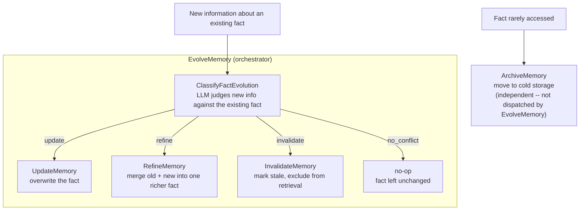

# MAG: Memory-Augmented Generation

This document is the detailed reference behind CLAUDE.md's MAG paradigm — the nine-concept memory system that the original project brief's section compressed into a three-tier table, four one-line memory types, four one-line "Key Operations," and four "Key Combinations" bullets. That compression drops real substance: memory gating collapses to a single "Key Operations" line — "Token-budget filter before context injection" — where the source documents six distinct gating strategies, each optimizing for something different; memory evolution's "Key Operations" line, "Update stale facts, handle contradictions, archive old data," names Update and Archive directly and gestures at contradiction-handling generically, but drops **Refine** entirely — the operation that distinguishes merging new nuance into an existing fact from overwriting it outright; spreading activation, the graph-traversal retrieval mechanism that makes the Neo4j-backed memory graph more than a passive relationship store, goes unmentioned; and episodic memory's five required properties — the criteria the source uses to define what actually counts as an episodic memory rather than a timestamped log line — appear nowhere in CLAUDE.md at all. Everything below traces to `docs/inputs/concepts/advanced_mag_concepts.md`, the source the original project brief's §5.3 compressed; this page restores what that compression left out.

## The nine concepts at a glance

| Concept | Stage | Core Value | Best Combined With |
|---------|-------|-----------|---------------------|
| Memory Hierarchy | Architecture | Organization | Gating, Retrieval, Consolidation |
| Episodic Memory | Storage | Experience capture | Semantic, Consolidation, Graphs |
| Semantic Memory | Storage | Timeless knowledge | Consolidation, Evolution, Retrieval |
| Consolidation | Processing | Knowledge creation | Episodic, Semantic, Graphs |
| Retrieval Strategies | Retrieval | Multi-factor search | Graphs, Gating, Hierarchy |
| Memory Graphs | Storage/Retrieval | Relational context | Episodic, Semantic, Retrieval |
| Memory Gating | Pre-Generation | Context curation | Hierarchy, Retrieval, Semantic |
| Memory Evolution | Maintenance | Freshness | Semantic, Graphs, Retrieval |
| Procedural Memory | Storage | Skill reuse | Episodic, Consolidation, Retrieval |

(`docs/inputs/concepts/advanced_mag_concepts.md`, closing Summary table)

## How MAG's five pipeline stages fit together

The source's pipeline runs Input → Storage → Processing → Retrieval → Generation, and each of the nine concepts sits in exactly one stage (`docs/inputs/concepts/advanced_mag_concepts.md`, §3.2). **Input** is where a turn begins — user input, tool outputs, and observations are the raw material every later stage works on. **Storage** is the busiest stage by concept count: Episodic Memory, Semantic Memory, Procedural Memory, Memory Graphs, and Memory Hierarchy all live here, because storage is where each memory type's own representation — a JSON log with embeddings, a key-value fact, a workflow template, a node-and-edge graph, a tier assignment — actually gets written down. **Processing** covers Consolidation and Evolution, the two concepts that transform what's already stored rather than writing something new: one turns episodes into facts, the other keeps facts current. **Retrieval** covers Retrieval Strategies and Graph Traversal, the two ways stored memory gets pulled back out once a query needs it. **Generation** is the last stop before the LLM runs: Memory Gating decides what survives from everything Retrieval found, and the LLM's response is what Storage records as the next episode — closing the loop back to Input for the next turn.

## Memory Hierarchy: matching memory to its purpose

Storing every memory in one undifferentiated store is, in the source's own framing, like keeping a grocery list, a doctoral thesis, and childhood photos in the same box — retrieval becomes slow, noisy, and contextually blind, made worse by the fact that an LLM's context window is tiny relative to an agent's lifetime of experience (`docs/inputs/concepts/advanced_mag_concepts.md`, Concept 1). Memory Hierarchy is the fix: organize memory into tiers by access speed, scope, and how long the information needs to live, rather than treating a fact from six months ago and the current turn's working state as equally cheap to reach.

| Tier | Name | Scope | Speed | Lifespan | Storage (this project) |
|------|------|-------|-------|----------|--------------------------|
| 1 | Short-Term / Working | Current session | Fastest (in-context) | Seconds–minutes | LLM context window |
| 2 | Medium-Term / Recall | Recent interactions | Fast | Hours–days | Redis |
| 3 | Long-Term | All-time knowledge | Slower | Months–years | PostgreSQL + Qdrant + Neo4j |

(`docs/inputs/concepts/advanced_mag_concepts.md`, Concept 1; the original project brief's §5.3)

Short-term memory is literally the LLM's context window — the immediate conversation, constantly trimmed, summarized, or compressed as it fills. Medium-term memory holds recent conversation history, tool outputs, and reasoning traces that persist across turns but may expire; the source assigns it to fast in-memory storage, which this project instantiates as Redis. Long-term memory is where semantic facts, episodic events, and procedural skills survive session restarts entirely; the source leaves its storage generic ("Vector DB / Graph DB"), and this project's own schema (`docs/database/DATABASE.md`) makes that concrete as PostgreSQL, Qdrant, and Neo4j working together. The source grounds tiering in four points: context windows are finite even at their largest (4K–2M tokens), not all past information is equally relevant to the current turn, different memory types genuinely need different retrieval strategies, and the tiering itself mirrors human cognitive architecture rather than being an arbitrary engineering choice. The rule that falls out of all four: hot data belongs in context, warm data in RAM, cold data in a persistent store — matching each memory to its purpose rather than its convenience.

The tier table's "Fast" and "Slower" labels describe the tiering's design intent, not a settled measurement, and a live benchmark against this project's own code found the gap between them isn't reliable at the scale actually tested. `evaluation/reports/mag-foundation.md` originally reported Redis reading a session's recent turns 1.39× faster than the equivalent Postgres round trip, then retracted that claim once a benchmarking bug was found: the `ANALYZE` call meant to give Postgres a correctly-informed query plan was silently running through a connection that lacked the privilege to update table statistics at all, returning success while changing nothing. Once `ANALYZE` ran through a properly-privileged connection instead, four corrected runs against 12,000 episodic-memory rows across 400 sessions showed Postgres at or slightly *faster* than Redis, with ratios between 0.94× and 0.98× — both paths comfortably sub-millisecond, and `EXPLAIN` confirmed Postgres was genuinely using its index rather than a sequential scan in every run. `tests/integration/test_working_memory_latency.py` no longer asserts a specific direction, since asserting one would mean asserting whichever side happened to win a given run rather than a property the architecture actually guarantees. The reasoning for a fast working-memory tier is still sound in principle — a Redis key's cost doesn't grow with how many other sessions exist, where a B-tree lookup's cost has some dependence on total table size even while it stays sub-linear — but whether that difference becomes measurable at a materially larger table, under concurrent load, or over a real network rather than loopback is untested, not confirmed, by what's actually been run so far.

## Episodic memory: the diary an agent needs to learn from experience

An agent that stores only facts forgets the journey that produced them: it can know "Paris is the capital of France" while having no idea that a specific user booked a flight there last Tuesday and asked about vegan restaurants while planning the trip. Episodic memory closes that gap by storing specific, time-indexed experiences — interactions, decisions, tool calls, outcomes, and the context around them — answering not just "what is true" but "what happened, when, where, and why" (`docs/inputs/concepts/advanced_mag_concepts.md`, Concept 2).

The source defines episodic memory by five required properties, and each one rules out something a naive interaction log would otherwise get wrong. **Long-term storage** — persisting beyond the session — is required because a memory that vanishes when the session ends can't do the one thing episodic memory exists for: letting the agent recognize a user or a situation across separate conversations, rather than meeting a stranger every time. **Explicit reasoning** — the ability to reflect on memory content, not just replay it — is required because consolidation (below) depends on the agent being able to look back over a set of episodes and ask what patterns they show, which a store that can only retrieve verbatim text can't support. **Single-shot learning** — capturing information from a single exposure — is required because most of what an agent needs to remember about a specific event only happens once; unlike a semantic fact that can be reinforced across many conversations before it's trusted, an episode has exactly one occurrence to be captured correctly. **Instance-specific memories** — details unique to this particular occurrence — is what separates an episode from a semantic fact in the first place: "the user booked a flight to Paris last month" only means something as a specific instance, where the generalized version, "Paris is the capital of France," would lose everything that made it useful. And **contextual memories** — binding who, when, where, and why to the content — is required because an episode stripped of that context degrades into exactly the kind of context-free fact semantic memory already handles better; the who/when/where/why is what makes it an episode rather than a fact (`docs/inputs/concepts/advanced_mag_concepts.md`, Concept 2).

Encoding an episode captures the full event — input, reasoning trace, tool calls, output, outcome, timestamp, actors, and entities — which is then stored as structured JSON with vector embeddings for similarity retrieval, retrieved later by similarity, recency, or salience, periodically consolidated into durable semantic knowledge, and eventually evicted according to whatever policy governs what the store drops when it fills. The source's own contrast makes the payoff concrete: an episodic memory reads "On March 3, the pipeline failed because of a schema change in `orders`. The fix took 2 hours," where the semantic fact left behind once the episode is forgotten reads only "This pipeline sometimes fails" — losing the date, the cause, and the fix along with it.

## Semantic memory and consolidation: from experience to knowledge

Semantic memory is where an agent stores what is true rather than what happened — user preferences ("User prefers concise answers," "User is allergic to peanuts"), domain facts ("Our refund policy allows 30-day returns"), learned rules ("When the user asks about pricing, always check the enterprise tier first"), and entity profiles, all generalized and abstracted away from any single event that produced them (`docs/inputs/concepts/advanced_mag_concepts.md`, Concept 3). Building it runs through extraction (an LLM pulls facts out of conversations, documents, or tool outputs), deduplication (checking whether the fact already exists before writing a duplicate), storage (vector embeddings plus structured key-value pairs plus knowledge-graph entries), retrieval (semantic similarity, keyword lookup, or graph traversal), and updating (overwriting or flagging for review when a new fact contradicts an old one). Set against episodic memory directly, the difference is temporal and structural at once: "I booked a flight to Paris for User X last month" is time-stamped and contextual, where "Paris is the capital of France" is timeless and generalized — raw experience against distilled knowledge.

Consolidation is the process that turns the first kind into the second, and without it episodic memory just grows forever, both unsustainable to store and hard to retrieve meaningfully once it does. The source frames it as the same trick the brain performs converting a day's experience into long-term memory during sleep: collect a batch of episodes (the last N turns, or a time window), have the LLM reflect on them — what patterns emerge, what facts can be extracted, what insights were gained — extract that as semantic knowledge, write it to semantic memory, and mark or archive the source episodes as consolidated (`docs/inputs/concepts/advanced_mag_concepts.md`, Concept 4). The source frames the reflection step itself as following the Generative Agents pattern of weighting recency (favor recent episodes), relevance (favor episodes tied to current goals), salience (favor emotionally or logically significant episodes), and abstraction (pull general principles out of specific instances) — but the real `ConsolidateEpisodes` command (`src/mag/application/commands/consolidate_episodes.py`) selects its input batch by calling `get_unconsolidated_by_session`, which returns the oldest unconsolidated episodes first and applies none of those four weights at all: a backlog drain, not the recency/relevance/salience/abstraction selection the source describes (`evaluation/reports/mag-procedural-consolidation.md`). In steady state — consolidation run at least as often as episodes accumulate — the unconsolidated set coincides with the recent tail anyway, which is why oldest-first and the source's framing haven't yet visibly diverged in practice, but the moment a backlog exceeds what one run's batch size can clear, oldest-first keeps draining the backlog in arrival order while the source's weighting would instead keep favoring whatever's newest (`src/mag/domain/ports.py`, `get_unconsolidated_by_session`'s own docstring). The source's own example shows the shape of the output: three episodes of the user asking about Python, one about Go, and none about Rust consolidate into "User's primary language is Python. User has intermediate interest in Go" — three raw data points becoming one durable preference. Consolidation runs periodically (every N turns), when the memory store crosses a capacity threshold, at session end, or whenever the agent detects a pattern worth capturing early.

## Memory retrieval strategies: beyond semantic similarity

Retrieval decides what candidate memories get pulled out of storage in the first place — a different, earlier step than gating, which decides what survives from those candidates into the context window (below). Relying on plain semantic similarity alone breaks down because "similar" and "relevant" aren't the same thing: a query about Python debugging can match a cooking recipe about handling a python snake if the embedding model is imprecise, and the most relevant memory to a query might be six months old while similarity search keeps surfacing recent noise instead (`docs/inputs/concepts/advanced_mag_concepts.md`, Concept 5). The source names six strategies beyond plain similarity, each capturing something the others miss: semantic similarity for general meaning overlap, temporal retrieval for when recency itself is what matters, causal retrieval for cause-effect chains during troubleshooting or debugging, entity-based retrieval for "what do I know about User X"-style queries, salience scoring for weighting critical decisions or failures more heavily than routine turns, and recency-decay fusion for blending recent-and-relevant together for conversational continuity. A full retrieval pass runs all of them: decompose the query into its semantic intent, temporal constraints, entities, and causal triggers; run each strategy in parallel; fuse the resulting scores with learned or heuristic weights; deduplicate overlapping hits; and rank the survivors by composite relevance. The source's own worked example — "Why did the deployment fail last Tuesday?" — shows why running only one strategy would miss the answer: semantic similarity finds episodes about deployment failure in general, temporal retrieval narrows to that specific Tuesday, causal retrieval prioritizes episodes that actually contain an error trace, and entity-based retrieval keeps results focused on CI/CD rather than deployments of some other kind entirely.

## Memory graphs and spreading activation, for Neo4j specifically

Vector databases treat every memory as an isolated point in embedding space, but memories aren't actually isolated — "User X" connects to "booked a flight" connects to "Paris" connects to "asked about vegan food" connects to "recommended Le Potager du Marais," and none of those relationships are visible to a pure vector search that only ever compares one query embedding against one memory embedding at a time (`docs/inputs/concepts/advanced_mag_concepts.md`, Concept 6). A memory graph makes those relationships queryable directly by representing memories as nodes and their relationships as edges: episodic nodes for individual interaction turns (content, embedding, timestamp), semantic nodes for abstract concepts, entities, and preferences, temporal edges linking sequential episodes, abstraction edges connecting an episode to the semantic concept it distills into, and association edges modeling latent correlations between concepts. Building the graph means constructing a node for each new memory with its full attributes, then finding related existing memories and establishing edges to them as each new memory arrives.

Retrieval over that structure is where **spreading activation** comes in: start from the node (or nodes) that match the query, activate them, and propagate a relevance score outward along their edges to connected nodes, with the most-activated subgraph — not just the single best-matching node — returned as context. The source's own example makes the payoff concrete: a query like "What restaurants did I recommend to User X?" might not match anything if a plain vector search is only looking for the literal word "restaurants" and that word never appears in the original conversation — but graph traversal starting from the User X node, following the booked-flight edge to Paris, the asked-about-food edge, and the recommended edge, reaches the answer through the chain of relationships instead of needing the right keyword to be present anywhere.

This project stores its memory graph in Neo4j specifically (`docs/database/DATABASE.md`), and spreading activation is exactly the retrieval pattern a native graph database is built to run efficiently. This project's Neo4j schema *defines* `User`, `Session`, `Entity`, `Concept`, `Episode`, and `Fact` nodes connected by `PARTICIPATED_IN`, `MENTIONS`, `RELATED_TO`, `ABSTRACTS_TO`, and `TEMPORALLY_FOLLOWS` edges, indexed on `Entity.name` and `Entity.embedding` (`docs/database/DATABASE.md`) — but "defined in the schema" and "actively written by a command" aren't the same claim, and two of those eleven names are only the former. `Neo4jMemoryGraphRepository` (`src/mag/infrastructure/neo4j_memory_graph_repository.py`) implements exactly four edge-writing methods — `link_participated_in`, `link_temporally_follows`, `link_mentions`, and `link_abstracts_to` — each wired into `CaptureEpisode`, `RecordSemanticFact`, or `ConsolidateEpisodes`. `RELATED_TO` has no fifth writer method at all, and `Concept` has neither a uniqueness constraint nor a writer of its own: both are schema-defined and present in `DATABASE.md`'s node/edge list, but never instantiated by any command in this codebase, because nothing in episode capture, fact recording, or consolidation currently distinguishes "an abstract concept" from "an entity" as a separate write target (`evaluation/reports/mag-memory-graphs.md`). `User`, `Session`, `Entity`, `Episode`, and `Fact` are the five node types actually populated; `PARTICIPATED_IN`, `MENTIONS`, `ABSTRACTS_TO`, and `TEMPORALLY_FOLLOWS` are the four edge types actually written. That structure's entire value is in how cheaply it lets a traversal hop from one node across a typed edge to the next, which is precisely the operation spreading activation repeats outward from the query node until relevance decays past whatever threshold the retrieval step sets. A vector store has no equivalent operation to reach for here; it can find nodes that resemble the query, but it has no notion of an edge to follow at all, which is exactly the gap Memory Graphs closes and which the entity-based and causal retrieval strategies above can lean on once that graph exists.

The real implementation adds two things the source's own description leaves unstated. When a node is reachable from the query by more than one path, its activation is the *maximum* over those paths, not their sum — a tie-break rule that keeps a node's score bounded by its single strongest connection rather than inflating with every additional route in. And both the hop count and the decay factor are validated inputs rather than open parameters: a review caught both silently accepting values that would corrupt the result — a decay factor outside `(0.0, 1.0)` that could invert the ranking, or a hop count outside `[1, 10]` that could crash Cypher's variable-length-path parsing — so both are now range-checked before a traversal runs (`evaluation/reports/mag-memory-graphs.md`).

## Memory gating: guarding the context window

Even with perfect retrieval, stuffing every relevant memory into the context window backfires: LLMs suffer from "lost in the middle," where information buried in the center of a long context gets effectively ignored, and irrelevant memories crowd out the ones that actually matter to the current turn (`docs/inputs/concepts/advanced_mag_concepts.md`, Concept 7). Memory gating is the filter that decides which retrieved memories actually make it into the context window, and in what order — retrieval finds candidates, gating chooses the finalists.

The source names six gating strategies, and each optimizes for a different failure mode of the others. **Top-K selection** just takes the N highest-scoring memories — the simplest and fastest option, and the right default when speed matters more than nuance and the scoring function is already trustworthy. **Token budget allocation** instead fills the context window by relevance until the token limit is hit, maximizing information density rather than memory count — a better fit than Top-K when memories vary wildly in length, since Top-K can waste budget on N short memories when a different mix would pack in more actual information. **Hierarchical assembly** places the most important information first and supporting detail after, which matters specifically because of the lost-in-the-middle effect above: if a model is going to under-weight whatever lands in the middle of the context, the fix is ordering, not just selection, so this strategy is the one to reach for when what's included is already right but the order isn't protecting the critical facts. **Recency-weighted sampling** biases toward recent memories while still making room for old-but-salient ones, which suits conversational continuity specifically — a strategy oriented purely at freshness will misfire in a domain where a six-month-old fact still matters, and recency-weighting is the version of freshness-bias that doesn't discard those outliers outright. **Task-specific filtering** only includes memory types relevant to the current task, the strategy to reach for when the noise problem isn't too many memories but too many kinds of memory — a coding question doesn't need procedural memories about unrelated workflows cluttering the window regardless of how well those memories score on relevance alone. And **dynamic re-ranking** re-ranks the retrieved set based on the specifics of the current query rather than trusting the original retrieval score — the query-adaptive choice, useful when the same stored memory should be weighted differently depending on exactly how the current turn phrases its question, something none of the other five strategies adjust for on their own.

Assembling context runs all of this as a pipeline: retrieve candidates across every tier and strategy, score them by a composite of similarity, recency, salience, and task fit, filter by hard constraints, assemble the prompt with the resulting ordering, and inject the result into the system prompt or user context. The source names three hard constraints together — max tokens, forbidden topics, required inclusions — but the real `GateMemories` orchestrator (`src/mag/application/gating/gate_memories.py`) implements only the first: the max-tokens constraint each of the six named strategies already corresponds to. No strategy or orchestrator stage exists for topic denylisting or forced inclusion (`evaluation/reports/mag-memory-gating.md`). The source's own numbers show what this buys: given an 8K-token context window and 50 retrieved memories totaling 15K tokens, gating selects the top 20 memories (7K tokens), places user preferences and task-critical facts first, adds supporting episodic context after, and discards the rest as redundant or low-salience. The original project brief's own §5.3 named only token-budget allocation, under the label "Token-budget filter before context injection" — accurate as far as it went, but one strategy standing in for six, each suited to a different way retrieval can overwhelm the context window.

## Memory evolution: keeping knowledge current

Static memory is dead memory: a user who said "I live in New York" six months ago may have moved to Berlin since, and an agent that keeps retrieving the old fact without ever updating it gives wrong, frustrating answers — most memory systems simply append forever rather than ever revising what they already stored (`docs/inputs/concepts/advanced_mag_concepts.md`, Concept 8). Memory evolution is the process of updating, invalidating, refining, and archiving stored knowledge as new information arrives, and the source defines it as four distinct operations rather than one generic "update."

Update and Invalidate both fire because the old fact turns out to be wrong, but they diverge on what happens next. Update triggers when new information directly contradicts the old, and because the new information doubles as the correct replacement, its action is a straightforward overwrite — the old fact is replaced by the new one. Invalidate triggers when the old information is simply no longer true but nothing has arrived to take its place, so its action is softer: mark the memory stale and exclude it from retrieval, without necessarily replacing it with anything. Archive answers a different question entirely — not whether a memory is still correct, but whether anyone still needs it close at hand: it triggers when a memory is rarely accessed, and its action is to move that memory to cold storage while keeping it available for reference rather than deleting it outright. Refine is the operation the original project brief's §5.3 dropped entirely, and it does genuinely different work from Update and Invalidate alike: where those two both assume the old fact was wrong, Refine fires when new information adds nuance rather than contradicting anything, and its action is to merge the old and new into a single richer fact rather than throwing either one away. A user preference that starts as "prefers Python" and later gains "especially for data analysis, though open to Go for CLI tools" isn't a case where the earlier fact was wrong — it's a case where the earlier fact was incomplete, and Refine is the operation built for exactly that gap between "this fact is false, replace it" and "this fact is fine, leave it alone."

Handling a contradiction end to end is real code now, not just a described pipeline, and the real dispatch is the four operations described above rather than the three-way branch the source's own narration suggests. `ClassifyFactEvolution` (`src/mag/application/queries/classify_fact_evolution.py`) is the comparison step: an LLM judgment that reads an existing fact and a new piece of information and classifies their relationship as exactly one of four outcomes — `update`, `invalidate`, `refine`, or a fourth outcome no three-way branch has room for, `no_conflict`, returned when the new information isn't actually about this fact and nothing should change. `EvolveMemory` (`src/mag/application/commands/evolve_memory.py`) is the dispatcher: it calls the classifier, then routes to `UpdateMemory`, `RefineMemory`, or `InvalidateMemory` by whichever operation came back, doing nothing at all on `no_conflict`. Archive stays outside this dispatch by design — its trigger is access frequency, not a comparison against new information, so it remains independently invocable rather than a fifth branch this orchestrator has no way to reach.

What the source describes as a fourth step, propagation — pushing a change out to any linked memories in the graph so a fact doesn't go stale in one place while staying current somewhere else — isn't built. This schema has no edge type representing "these two facts are related" at all: `RELATED_TO` was scoped out of Memory Graphs' own batch and nothing since has added it, so `EvolveMemory` syncs only the single `Fact` node that actually changed, not a multi-hop walk to anything else (`evaluation/reports/mag-memory-evolution.md`). The source's own example is still Update in its plainest form and still holds end to end, live-verified against a real Ollama model rather than a fake: "User lives in New York" from six months ago gives way to "User moved to Berlin last week," `ClassifyFactEvolution` reads that as `update`, `EvolveMemory` dispatches to `UpdateMemory`, the location fact is updated to Berlin, and the old location is archived with its timestamp rather than simply deleted (`evaluation/reports/mag-memory-evolution.md`).

## Procedural memory: remembering how, not just what

An agent that remembers facts but forgets successful workflows re-reasons everything from scratch every time — it can know "the user likes Python" while having no memory that the last time this user asked for a REST API, FastAPI plus Pydantic plus SQLModel was the stack that worked and the user liked the result. Procedural memory closes that gap by storing learned skills, methods, workflows, and behavioral patterns, answering "how do I do this" and "what worked before" rather than "what is true" (`docs/inputs/concepts/advanced_mag_concepts.md`, Concept 9). The source groups what it captures into tool usage patterns ("for data analysis, always use pandas first, then plot with matplotlib"), successful workflows ("this 3-step process resolved 90% of the user's deployment issues"), communication styles ("user prefers code examples over explanations"), and decision policies ("when uncertain, ask a clarifying question rather than guessing"). Building it means observing agent actions, tool calls, and outcomes; evaluating whether the user accepted the answer or the task actually completed; extracting the pattern by having the LLM synthesize what sequence of actions led to success; storing it as a reusable procedure — a prompt template, a workflow graph, or a policy; and retrieving and applying it the next time the same task pattern recurs instead of reasoning from scratch. "The next time a similar task comes up" reads as similarity search, but the real retrieval path isn't fuzzy at all: `FindProcedure.by_task_pattern` (`src/mag/application/queries/find_procedure.py`) looks up a procedure by an exact match against the stored `task_pattern` string, and `ProceduralMemory` has no embedding column — a deliberate schema difference from episodic and semantic memory, not something left to fix later (`evaluation/reports/mag-procedural-consolidation.md`). The source's own example traces exactly that arc: an agent that helps a user deploy FastAPI five times using the same Docker-plus-Gunicorn-plus-Nginx stack distills that repetition into a stored procedure, so the next "how do I deploy my API?" loads the proven three-step answer instead of re-deriving it.

## High-synergy combinations

The original project brief's §5.3 already named four combinations under "Key Combinations (A+ Synergy)" without explaining why each one earned that label. All four are triple-technique archetypes the source works through in detail, and all four appear in the source's own "Top 5 Most Impactful Triples" (`docs/inputs/concepts/advanced_mag_concepts.md`, §2.3 and §4.2, Category 3) — but the source's pair-level compatibility matrix (§2.2) shows the label isn't uniformly earned pair-by-pair: two of the four archetypes have all three constituent pairs scored A+, and two have one pair scored a still-strong A rather than A+.

**Episodic + Semantic + Consolidation** — the source's "Living Agent" pipeline — is one of the archetypes where all three pairs score A+: Episodic+Semantic, Episodic+Consolidation, and Semantic+Consolidation are each rated the source's top synergy score. The mechanism is a closed loop rather than three independent good ideas: the agent accumulates experiences as Episodic memory, Consolidation periodically processes recent episodes and extracts facts, patterns, and insights, those get written to Semantic memory, and semantic knowledge grows richer with every interaction — the agent becomes more knowledgeable the longer it runs. The source names personal assistants, companion AI, and long-term learning agents as the fit for this pattern.

**Memory Hierarchy + Retrieval + Gating** — the "Context Wizard" pipeline — has two A+ pairs (Hierarchy+Gating, Retrieval+Gating) and one pair scored A rather than A+ (Hierarchy+Retrieval), which doesn't stop the source from naming it among its top five triples. Hierarchy organizes memory across the context/medium/long-term tiers, Retrieval searches all of them with multi-strategy scoring, and Gating selects the best of what Retrieval found to fit the token budget — the LLM ends up with an optimally curated context rather than whatever the first retrieval pass happened to return. The source names high-performance chatbots and customer support as the use cases where context quality is the whole game.

**Episodic + Procedural + Consolidation** — the "Self-Improving Agent" pipeline — has one A+ pair (Episodic+Consolidation) and two pairs scored A (Episodic+Procedural, Consolidation+Procedural). Episodic memory records every task execution, Consolidation analyzes which episodes succeeded and which failed, and that analysis extracts reusable Procedural memories — workflows and patterns — so future tasks load a proven procedure instead of reasoning from scratch each time; the source frames this as an agent that gets faster and more accurate over time, fitting task-oriented agents, coding assistants, and workflow automation.

MAG's Combinations batch (Batch G) built that mechanism — Consolidation itself walking from episodes to procedures — specifically to make the archetype's own claim true, closing a gap that, before this batch, had no implementation anywhere in this codebase. `ConsolidateProcedures` (`src/mag/application/commands/consolidate_procedures.py`) mirrors `ConsolidateEpisodes`'s retry/validate/dedupe shape, but reflects on a batch of episodes for a repeated task pattern rather than a single durable fact, and — unlike `ConsolidateEpisodes` — takes its episode batch as an explicit parameter instead of owning its own consolidated-episode lifecycle, since the same episode can legitimately contribute to more than one future pattern detection as repeats accumulate over time. Composing the two consolidation commands over the same window surfaced a real hazard the batch's review caught and fixed: `ConsolidateEpisodes.execute()` unconditionally marks every episode it fetches as consolidated regardless of whether a fact was extracted, so a caller building `ConsolidateProcedures`'s batch via the obviously-named `get_unconsolidated_by_session` *after* `ConsolidateEpisodes` has already run over that window gets an empty list back — silently, no exception, no log — permanently skipping procedure extraction for a session that may have a genuine repeated pattern sitting right there. The fix is a documented calling convention rather than a change to either command: build the shared batch via the unfiltered `get_by_session` instead, whose result doesn't depend on which consolidation command ran first, now recorded directly as a warning on `get_unconsolidated_by_session`'s own docstring (`src/mag/domain/ports.py`) and proven end to end by a dedicated composition test (`evaluation/reports/mag-combinations.md`).

**Memory Graphs + Episodic + Semantic** — the "Relationship-Aware Agent" pipeline — is the second archetype with all three pairs at A+ (Episodic+Graphs, Semantic+Graphs, Episodic+Semantic). Episodic nodes capture interactions, semantic nodes capture entities and concepts, and graph edges link them together — user, booked, flight, Paris — so a query like "what did I book last month" succeeds through relationship-hopping even when it's too vague for similarity search to match directly. The source names travel agents and CRM assistants as the fit, anywhere an agent has to manage genuinely relational information about its users rather than a flat list of facts about them.

All four archetypes share a structure worth naming explicitly, the same one that appears in every A+-heavy combination across the source: they aren't three independently good ideas bolted together, but a pipeline where one technique's output becomes the next one's input — episodes feeding consolidation, consolidation feeding semantic or procedural memory, graphs connecting what storage already holds — which is exactly the property that separates a genuine A+ combination from techniques that are merely compatible without reinforcing each other.
