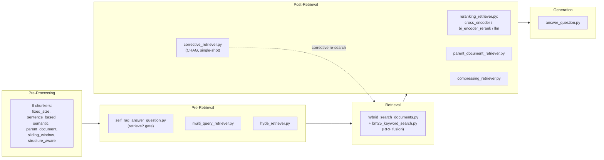

# RAG: Retrieval-Augmented Generation

This document is the detailed reference behind CLAUDE.md's RAG paradigm — the five-stage pipeline that turns a user's question into curated, external context; every chunking strategy this system can choose from and the tradeoff each one makes; the full reranker taxonomy and what each type actually costs in speed and accuracy; the precise difference between Query Expansion and Multi-Query Retrieval, which the original project brief's bullet list didn't distinguish; HyDE's exact mechanic; the quantified per-technique impact figures the source measures each concept against; and the phased path from a baseline system to a fully self-correcting one. Everything below traces to `docs/inputs/concepts/advanced_rag_concepts.md`, the document the original project brief's RAG section compressed into a five-line pipeline list and four "Key Combinations" bullets — this page restores what that compression left out.

## The nine concepts at a glance

| Concept | Stage | Core Value | Best Combined With |
|---------|-------|-----------|---------------------|
| Reranking | Post-Retrieval | Precision | Hybrid Search, CRAG, Parent Document |
| Hybrid Search | Retrieval | Recall | Reranking, Multi Query, CRAG |
| Chunking Strategies | Pre-Processing | Foundation | Parent Document, Semantic strategies |
| Multi Query Retrieval | Pre-Retrieval | Recall | Hybrid Search, Reranking, CRAG |
| Parent Document Retrieval | Post-Retrieval | Completeness | Reranking, Compression, CRAG |
| Context Compression | Post-Retrieval | Efficiency | Parent Document, CRAG, Reranking |
| HyDE | Pre-Retrieval | Query quality | Hybrid Search, Reranking, CRAG |
| Self-RAG | Pre-Retrieval | Efficiency | CRAG, Reranking, Compression |
| CRAG | Post-Retrieval | Validation | Reranking, Hybrid Search, Self-RAG |

(`docs/inputs/concepts/advanced_rag_concepts.md`, closing Summary table)

The percentages in that table are the source material's own "expected impact" estimates, carried over unchanged from `advanced_rag_concepts.md` — they describe what the concept document projected before any of this existed as code. Every one of these nine concepts has since been built and run against a live corpus, and that measurement uses a different methodology entirely: real task-success rates, real p50/p95 latencies, and real 1-5 qualitative judge scores from actual pipeline runs, not percentage-impact projections. The two shouldn't be read as the same kind of number or compared directly — one is a pre-implementation estimate, the other is a post-implementation measurement — and the real numbers, batch by batch, live under `evaluation/reports/` (for example `rag-chunking-semantic.md`, `rag-hybrid-reranking-hybrid.md`, `rag-crag-crag.md`, and the five `rag-combinations-*.md` reports). The rest of this document points to the specific implementation and report behind each concept as it comes up, so "expected impact" and "measured result" stay visibly distinct rather than blurring into one figure.

## How the five pipeline stages fit together

CLAUDE.md's pipeline runs Pre-Processing → Pre-Retrieval → Retrieval → Post-Retrieval → Generation, and the source is explicit about how techniques relate both within and across those stages (`docs/inputs/concepts/advanced_rag_concepts.md`, §3.2). Concepts that share a stage are either alternatives to each other or can be chained together — Multi-Query and HyDE both run in Pre-Retrieval, and a pipeline can use both at once rather than choosing one. Concepts in adjacent stages are always synergistic by construction, because the output of one stage is literally the input to the next — Hybrid Search's results feed straight into Reranking. Concepts that are further apart, like Chunking in Pre-Processing and Self-RAG in Pre-Retrieval, are still fully compatible but the synergy between them is weaker, since neither one's output directly shapes the other's input. CRAG is the one exception to that distance rule: it can feed corrections back to any earlier stage — re-chunking isn't on the table, but re-querying, re-searching, and re-ranking all are — which the source calls its "superpower," because no other concept in this set can reach back across the whole pipeline the way CRAG's corrective loop can.

Every box below names a real module under `src/rag/`, not a planned one — the diagram exists to make that "built" status visible at a glance alongside the prose that follows it.

## Pre-Processing: chunking decides what "a piece of knowledge" even means

Every later stage depends on this one, because retrieval can only ever be as good as the units it's retrieving. The source states the failure modes plainly: a chunk that's too big buries the relevant sentence in the middle of a wall of text the model has to search through on its own, and a chunk that's too small strips away the surrounding context that makes the sentence meaningful in the first place (`docs/inputs/concepts/advanced_rag_concepts.md`, Concept 3). Its golden rule for sizing chunks is to keep them "as small as possible to be precise, but as large as necessary to be complete" — precision and completeness pulling in opposite directions, with the right chunk size being wherever that tension settles for a given document set.

The source documents six chunking strategies, each making a different version of that same tradeoff. Fixed Size chunking splits text into a fixed length — 500 tokens, say — with some overlap between consecutive chunks; it's simple and fast to implement, but because it cuts at a token count rather than a meaning boundary, it can slice straight through the middle of a sentence. Sentence-Based chunking splits at sentence boundaries instead, which preserves meaning within each chunk, but because sentences vary wildly in length, the resulting chunks vary just as wildly in size, which makes retrieval and reranking harder to tune consistently. Semantic Chunking groups content by semantic similarity rather than by position in the document, producing chunks that are genuinely topic-coherent and highly relevant to whatever a query touches on that topic — at the cost of needing an embedding model to do the grouping, which makes it the most complex of the six to implement. Parent Document Chunking keeps the retrieval unit small but stores a pointer to a larger parent section, so a small chunk can be searched precisely while a bigger one gets returned for context — more context for the model, at the cost of higher token usage once that larger parent gets pulled in. Sliding Window chunking moves a window across the text step by step rather than chunking it once, which gives good coverage and keeps the narrative flow intact across chunk boundaries, but multiplies how much has to be stored since the windows overlap. Structure-Aware chunking respects the document's own structure — headings, lists, tables, code blocks — which keeps chunks aligned with how the document's author actually organized the ideas, but only works as well as the parser that has to recognize that structure in the first place.

The original project brief's own §5.1 named this stage's six strategies as "fixed, semantic, recursive, parent-document, sliding window, structure-aware" — a list that borrowed "recursive" chunking from a different source entirely (`docs/inputs/concepts/fullstack_unified_ai_system.md`'s module blueprint names a `recursive.py` file but never explains what the strategy does). `advanced_rag_concepts.md`, the document this page restores, documents a different sixth strategy — Sentence-Based, with the explicit tradeoff described above — so that's the one covered here rather than reproducing an unexplained substitution from a document with no worked description of it.

The source's practical guidance for this stage: test a few sizes (256, 512, and 1024 tokens are its suggested starting points), use 10-20% overlap between chunks so information near a boundary isn't lost entirely to one side, and evaluate the results with real retrieval metrics rather than picking a size and moving on. Its stated common practice for production systems is a hybrid of three of the six strategies at once — structure-aware splitting, semantic grouping within that structure, and parent-document retrieval on top — rather than picking a single strategy in isolation. Chunking's own expected payoff, measured in isolation, is a +10-20% gain in relevance (`docs/inputs/concepts/advanced_rag_concepts.md`, Category 1 table) — a smaller figure than most of the other eight concepts report, which tracks with its role as the foundation everything else builds on rather than a technique that adds new capability on its own.

All six strategies exist as real, individually unit-tested code, not just this section's description of the tradeoff: `src/rag/infrastructure/fixed_size_chunker.py`, `sentence_based_chunker.py`, `semantic_chunker.py`, `parent_document_chunker.py`, `sliding_window_chunker.py`, and `structure_aware_chunker.py`, each with a corresponding test under `tests/unit/` (semantic chunking additionally has an integration test, `tests/integration/test_semantic_chunker.py`). Each strategy has also been run against a live corpus and measured — `evaluation/reports/rag-chunking-fixed-size.md`, `rag-chunking-sentence-based.md`, `rag-chunking-semantic.md`, `rag-chunking-sliding-window.md`, and `rag-chunking-structure-aware.md` carry the real task-success, latency, and judge-score numbers for each one; see the note at the top of this document on how those numbers relate to the source's own expected-impact percentages above.

## Pre-Retrieval: deciding whether to search, and what to search for

Three techniques live in this stage, and they answer two different questions in sequence. The first question is whether to search at all. **Self-RAG** is the gate: instead of retrieving for every query unconditionally, the LLM first checks its own knowledge and decides YES or NO. A question like "What is 2 + 2?" gets answered directly, with no retrieval cost at all, while a question like "What are the latest FastAPI release notes?" triggers retrieval because the model can't know that from training alone (`docs/inputs/concepts/advanced_rag_concepts.md`, Concept 8). The source's stated NO-cases are general knowledge, math and logic, common sense, and questions the model is already confident about; its YES-cases are recent or live information, domain-specific or private-document knowledge, and complex multi-hop questions. The payoff for skipping retrieval when it isn't needed is concrete: the source's expected impact is a 30-50% reduction in retrieval costs, purely from not paying for lookups the model didn't need.

Self-RAG's gate is built (`src/rag/application/self_rag_answer_question.py`) and measured against a live corpus in `evaluation/reports/rag-query-enhancement-self-rag.md`, whose gate log shows the real, question-by-question YES/NO split rather than an assumed one (15 YES / 6 NO across that run's 21 treatment calls). That report also carries a disclosed correction: an earlier run of this same code had HyDE's and Self-RAG's no-context answering path silently degrade into a refusal, because `ChatModel.generate()` hardcodes a "use only the provided context" system prompt that fights any caller — like Self-RAG's own no-retrieval-needed branch — trying to get the model to answer from its own knowledge instead. That bug and its fix are covered in full in this document's closing section below.

If retrieval is going to happen, the second question is what to actually search for — and this is where the source draws a distinction that's easy to blur: **Query Expansion versus Multi-Query Retrieval**.

| Feature | Query Expansion | Multi-Query Retrieval |
|---------|-----------------|------------------------|
| Focus | Better wording | Different viewpoints |
| Queries produced | Similar to each other | Diverse from each other |
| Recall gain | Good | Much higher |
| Typical use case | General | Production RAG |

(`docs/inputs/concepts/advanced_rag_concepts.md`, Concept 4)

Query Expansion takes the original question and produces variants that are still, fundamentally, the same question — synonyms, related terms, slightly different phrasing of the same underlying ask. It stays pointed in one direction. Multi-Query Retrieval instead has an LLM generate several genuinely different framings of the underlying information need — not just reworded, but viewed from different angles — and searches each one independently before merging and reranking the combined results. The source's own framing of why this matters is direct: "Even with Query Expansion, still searching in one direction... What if the answer is written completely differently?" A single viewpoint, however well-worded, only ever finds documents that share that viewpoint's vocabulary; Multi-Query's diverse phrasings can each surface a different slice of the document set that the others would have missed entirely, which is why its recall gain (+25-35%, per the source's Category 1 figures) sits noticeably above Query Expansion's more modest "good." The source names its production use cases as large or messy knowledge bases, technical documentation with inconsistent terminology, and enterprise, legal, or medical search — domains where the same fact really does get written up in more than one vocabulary across a document set.

Multi-Query is built as `src/rag/infrastructure/multi_query_retriever.py` and measured in `evaluation/reports/rag-query-enhancement-multi-query.md`; it's also the technique this document's combinations section pairs with HyDE below, and that pairing has its own dedicated implementation and report (`rag-combinations-multi-query-hyde.md`).

The third Pre-Retrieval technique, **HyDE (Hypothetical Document Embeddings)**, solves a different problem: a question that's too short or too vague to search well in the first place. Its mechanic is worth stating precisely, since it's easy to get backwards: HyDE has the LLM generate a hypothetical answer to the question first, and it is *that generated answer's embedding* — not the original question's embedding — that gets used to search the vector database (`docs/inputs/concepts/advanced_rag_concepts.md`, Concept 7). The reason that produces better retrieval than embedding the question directly comes down to what embeddings actually compare: a short, vague question and a long, detailed document chunk that answers it don't share much vocabulary or structure even when the chunk is exactly the right one, so their embeddings can end up further apart in vector space than you'd want. A hypothetical answer, even though the model is inventing it and it may not be factually correct in its details, is written in the same register as a real answer would be — the same terminology, the same level of specificity, the same shape — so its embedding lands much closer to a genuinely correct chunk's embedding than the terse original question's embedding ever would. The source's own example makes this concrete: for the query "FastAPI background tasks," a direct search on the bare question surfaces generic Python background-processing terms — Celery, threading, cron jobs, async jobs — none of which are FastAPI-specific, while a HyDE search surfaces `BackgroundTasks` and `add_task`, which are FastAPI's own actual API objects, because the hypothetical answer the model generates naturally uses FastAPI's real vocabulary rather than the question's generic phrasing. The source is careful to note this isn't just guessing: a good hypothetical answer is structured, relevant, and domain-aware, and it captures meaning the user intended but didn't have the words to express. Its expected impact is a +20-30% recall gain specifically for vague queries, and its own tips recommend keeping the generated answer concise but rich, and combining HyDE with Reranking and Hybrid Search for maximum effect — both of which are covered in the synergy section below.

HyDE is built as `src/rag/infrastructure/hyde_retriever.py` and measured in `evaluation/reports/rag-query-enhancement-hyde.md`, whose query log records real generated hypothetical answers rather than a description of what one might look like — for example, a live run's hypothetical answer for a Multi-Query question: *"According to RAG.md, Multi-Query Retrieval differentiates itself through parallel semantic paraphrase generation rather than lexical augmentation as seen in Query Expansion..."*. That report shares the same `generate()`/`complete()` refusal bug and re-run described for Self-RAG above and in this document's closing section.

## Retrieval: Hybrid Search combines meaning and keywords

The Retrieval stage itself is where Hybrid Search runs. Its premise is that relying on only one search method loses good results the other method would have caught: vector search finds meaning even when the exact words don't match, but it can miss a query that hinges on an exact keyword, spelling, or abbreviation the way keyword search catches naturally; keyword search (BM25) catches exact terms but has no concept of meaning, so it misses a document that says the same thing in different words (`docs/inputs/concepts/advanced_rag_concepts.md`, Concept 2). Hybrid Search runs both in parallel — vector search returns its top results, BM25 returns its top results — and merges the two result sets, typically via Reciprocal Rank Fusion (RRF), though the source also lists Weighted Score Combination, Relative Score Fusion, and Rank Based Fusion as alternative merge methods. The source's stated cases where hybrid search earns its keep are documents that mix technical terms with natural language, queries with spelling mistakes or abbreviations, document sets with inconsistent wording across sources, and any situation that needs both high recall and high precision at once — which in practice is most production systems. Its expected impact in isolation is a +20-30% recall gain.

Hybrid Search is built as `src/rag/infrastructure/hybrid_search_documents.py` (RRF fusion) over `bm25_keyword_search.py`'s keyword arm, and measured on its own in `evaluation/reports/rag-hybrid-reranking-hybrid.md`. Four more reports in that same batch measure it paired with each reranker type — `rag-hybrid-reranking-hybrid-rerank-cross-encoder.md`, `rerank-bi-encoder.md`, `rerank-cross-encoder.md`, and `rerank-llm.md` — which is the synergy the next section's "production standard" pairing describes.

## Post-Retrieval: turning a noisy candidate pool into trustworthy context

Four techniques operate after retrieval has already returned candidates, each fixing a different way that raw retrieval output falls short of what the LLM actually needs.

**Reranking** exists because the vector database's initial ranking and the LLM's actual need for relevance aren't the same thing. A search might return 20 chunks, but the LLM typically only sees the top 3-5 — so if the best answer is sitting at position #19, it never reaches the model at all (`docs/inputs/concepts/advanced_rag_concepts.md`, Concept 1). A reranker fixes this by looking at the query and each retrieved chunk together, rather than scoring them independently the way the initial search did, and asking specifically "does this chunk actually answer the question" rather than "is this chunk topically similar to the question." The source's own worked example: for "How to deploy FastAPI in production?", a search without reranking might put a chunk about logging at #1, while reranking correctly promotes the chunk about Gunicorn and Nginx — the actual deployment answer — to the top. The source documents three types of reranker with a real accuracy/speed/cost tradeoff between them:

| Type | Accuracy | Speed | Cost |
|------|----------|-------|------|
| Cross-Encoder | High | Slower | Medium |
| Bi-Encoder + Rerank Model | Balanced | Balanced | Balanced |
| LLM-based Reranker | Highest | Slowest | Costliest |

(`docs/inputs/concepts/advanced_rag_concepts.md`, Concept 1)

Cost and speed move together across all three rows, and accuracy moves in the opposite direction: the Bi-Encoder-plus-Rerank-Model approach is the middle-of-the-road option on every axis at once, the Cross-Encoder trades some speed for higher accuracy at a moderate cost increase, and an LLM-based reranker — using a full language model to judge each candidate — buys the highest accuracy of the three but is also the slowest and most expensive, since it's paying for a full LLM call per comparison rather than a lighter purpose-built scoring model. Which one to reach for is a latency-and-cost decision as much as an accuracy one: the source's own beginner implementation path picks "a lightweight cross-encoder reranker (e.g., BAAI/bge-reranker-base)" specifically because it's fast enough to run on every request without becoming the pipeline's bottleneck, reserving the more expensive options for pipelines where getting the ranking exactly right is worth paying more for. Reranking's own expected impact, in isolation, is a +15-25% gain in answer accuracy.

All three reranker types are built — `src/rag/infrastructure/cross_encoder_reranker.py`, `bi_encoder_rerank_reranker.py`, and `llm_reranker.py` — sitting behind a shared `reranking_retriever.py` decorator that any inner retriever can be wrapped in. Each is measured individually in `evaluation/reports/rag-hybrid-reranking-rerank-cross-encoder.md`, `rerank-bi-encoder.md`, and `rerank-llm.md`.

**Parent Document Retrieval** solves a problem that shows up specifically when chunks are kept small for precise search: a small chunk that matches the query well can still fail to make sense on its own, because it's missing the surrounding context that gave it meaning in the source document (`docs/inputs/concepts/advanced_rag_concepts.md`, Concept 5). The source's example: for "Why did FastAPI become so popular?", the matching chunk on its own reads as an incomplete fragment — "...it is fast, easy to use, and has automatic docs..." — while the parent section it came from reads as a complete explanation, adding async support and developer experience to the picture. The mechanic is to search against small chunks for precision, then map each top result back to its parent document, page, or section before sending anything to the LLM, so retrieval stays precise while the model still receives complete context. The source recommends this specifically for very small chunks (100-300 tokens), documents that lean heavily on cross-references, and questions whose answers genuinely need full surrounding context — with the caveat to avoid pulling in too many parents at once and to balance parent size against relevance. Its expected impact in isolation is a +15-20% gain in completeness.

Parent Document Retrieval is built as `src/rag/infrastructure/parent_document_retriever.py`, paired with `src/rag/application/upload_document_with_parents.py` on the ingestion side to save both tiers of chunk at indexing time. `evaluation/reports/rag-parent-doc-compression-parent-document.md` measures it in isolation; the caveat about "not pulling in too many parents at once" turns out to have a sharper, measured edge to it once this technique runs downstream of Hybrid Search's BM25 arm, covered in the high-synergy section below.

**Context Compression** solves the opposite problem: too much retrieved material rather than too little. If a retriever surfaces 40 chunks but the LLM can only usefully take 8, sending everything means the model gets distracted, the important information gets buried, and answer quality drops even though nothing relevant was technically left out (`docs/inputs/concepts/advanced_rag_concepts.md`, Concept 6). Compression removes duplicate chunks, filler sentences, low-relevance material, overly long-winded detail, and off-topic content, using methods the source lists as LLM summarization, keyword or keyphrase extraction, redundancy removal, extractive compression, and relevance scoring. Two different numbers describe its payoff and shouldn't be conflated: the source's specific worked example of shrinking 40 retrieved chunks down to 8 puts the reduction at roughly -75% in token usage for that particular case, with a corresponding rise in answer quality; its more general, cross-deployment expected-impact figure is a more conservative -50% in tokens with about a +10% gain in focus. The source's own tips underline that the target is answer quality, not just a smaller token count — measure quality, not just size — and that a small, clean context reliably beats a huge, noisy one, to the point that compression is worth investing in ahead of simply reaching for a bigger model.

Context Compression is built as `src/rag/infrastructure/compressing_retriever.py`. `evaluation/reports/rag-parent-doc-compression-context-compression.md` measures it alone; `rag-parent-doc-compression-parent-document-compression.md` and `rag-parent-doc-compression-no-compression.md` round out that same batch, measuring the Parent Document + Compression pairing and a no-compression control against the same corpus and questions.

**CRAG (Corrective RAG)** is the validation step: it doesn't trust that retrieval got it right just because something came back. Its loop is retrieve, evaluate, decide, and — if needed — correct: for each retrieved document it asks whether the document is relevant, complete, and consistent, and whether it actually supports the query; documents that pass get used, and if the set as a whole fails, CRAG triggers a correction — refining the query, trying an alternative search, expanding and re-ranking, or filtering out the noise — before anything reaches the LLM (`docs/inputs/concepts/advanced_rag_concepts.md`, Concept 9). The source's example: for "Best database for real-time analytics?", a retriever might return a mix of relevant, outdated, and off-target material side by side — a SQLite tutorial, outdated MongoDB basics, a ClickHouse case study, a Postgres setup guide — and CRAG's job is to check that mix, weed out what's weak or stale, and either fall back to what passed evaluation or retrieve again to fill the gap, so only validated material reaches the model. Its expected impact in isolation is the largest single-technique number the source documents: a 40-60% reduction in hallucinations, which tracks with its role as a dedicated safety net rather than a technique that improves any one part of the retrieve-and-rank pipeline directly.

CRAG is built as `src/rag/infrastructure/corrective_retriever.py` and measured in `evaluation/reports/rag-crag-crag.md`, whose correction-firing log shows the real per-question decisions rather than an assumed rate (correction fired on 3 of 21 treatment calls, 14%, in that run). The shipped relevance-review step keeps whatever passes and only triggers a correction when the entire batch fails — a real bug found and fixed during implementation is folded into that design, covered along with a second, unrelated bug in this document's closing section.

## Generation: where the curated context pays off

The Generation stage itself is comparatively simple to describe, because its quality is a direct function of everything upstream: the LLM answers using whatever curated, validated context the four prior stages assembled. The original project brief's own §5.1 stated this plainly as "LLM with curated context," and the source doesn't add pipeline mechanics to this stage the way it does for the other four — its detail lives entirely in how well Pre-Processing, Pre-Retrieval, Retrieval, and Post-Retrieval did their jobs before the model ever sees the prompt.

This stage is built as `src/rag/application/answer_question.py`, the plain baseline every evaluation report's "Treatment" arm ultimately calls once its own upstream retriever chain has assembled context — every report under `evaluation/reports/rag-*.md` measures some variant of this stage receiving a different upstream chain's output, which is why the reports live per-technique rather than per-stage.

## High-synergy combinations

The source's compatibility matrix crosses each of the nine concepts against every other and marks every single cell compatible. Its conclusion is stated without qualification: "ALL 9 concepts are mutually compatible. There are zero conflicts. Only constraints are latency, cost, and complexity budgets" (`docs/inputs/concepts/advanced_rag_concepts.md`, §3.1, §3.4). That reframes the design question: it's never "does combining these two break something," it's "is the added latency and cost worth the accuracy this combination buys." Four pairings stand out because the source scores them A+ and lists them among its "Top 5 Most Impactful Pairs" (§2.2, Category 2):

**Hybrid Search + Reranking** — the source calls this "the production standard." Hybrid Search casts the widest possible net by returning candidates from two different notions of relevance at once, semantic similarity and keyword overlap; Reranking's whole job is to take a noisy, merged candidate pool and sort it by what actually answers the query. Each one fixes the other's weak point: Hybrid Search alone has no way to rank its own combined results well, and Reranking alone can only rank whatever narrow pool it's handed — put together, the reranker receives candidates from both the vector and keyword arms and compares semantic relevance against keyword density directly, which eliminates false positives that either method would have let through on its own (`docs/inputs/concepts/advanced_rag_concepts.md`, §4.1).

**Multi-Query + HyDE** — scored for "maximum recall for vague queries." HyDE strengthens a single query into one especially strong, well-worded search signal; Multi-Query instead generates several differently-angled phrasings. Combined, a pipeline can generate multiple hypothetical answers, or treat HyDE's hypothetical answer as one query among several diverse ones — dual enrichment of the same underlying search, covering both "make one query stronger" and "cover more angles" at once, rather than choosing between the two strategies (`docs/inputs/concepts/advanced_rag_concepts.md`, §4.1).

**Reranking + CRAG** — the source's "double-layer quality assurance." CRAG evaluates whether the retrieved documents are actually good; when it rejects a batch and triggers a corrective retrieval loop, reranking runs again on the new results, giving the pipeline two independent passes at quality rather than one — an initial relevance ranking, and a second correctness check that can send bad results back through ranking again rather than letting a single pass be the only safeguard (`docs/inputs/concepts/advanced_rag_concepts.md`, §4.1).

**Parent Document + Context Compression** — described as "the perfect balance" for complete yet compact context. Parent Document deliberately trades precision for completeness by expanding small chunks into larger parent sections, which necessarily adds tokens; Compression trims exactly that expansion back down, removing the redundancy and noise the larger parent sections introduce without losing the completeness Parent Document was retrieved for in the first place. The two techniques pull in opposite directions on token count by design, which is precisely why running them together lands closer to the sweet spot than either one alone (`docs/inputs/concepts/advanced_rag_concepts.md`, §4.1).

These four pairs aren't isolated recommendations — the source's own named "Production Grade" pipeline archetype chains three of them directly: Hybrid Search casts the wide net, Reranking narrows it to true relevance, CRAG validates the result and triggers correction when needed, and Context Compression optimizes what's left before it reaches the LLM, which the source calls "the gold standard for production RAG systems" (`docs/inputs/concepts/advanced_rag_concepts.md`, Archetype G). At the other end of the spectrum, its "Fort Knox" pattern chains six concepts together — Hybrid Search, Multi-Query, HyDE, Reranking, CRAG, and Parent Document — for what it describes as "unbeatable accuracy" at the cost of high latency and high cost, while its "Speed Demon" pattern (Self-RAG, Hybrid Search, Reranking, Context Compression) is explicitly optimized for speed and cost at the price of "slightly lower recall than Fort Knox." Both are legitimate choices under the same zero-conflict compatibility matrix — the only real question is which side of the latency-cost-accuracy trade a given system needs to land on, which is exactly the shape the roadmap below follows.

All five named combinations above are built, not just described — composed by nesting the same `Retriever` decorators covered earlier in this document in the exact order `docs/superpowers/specs/2026-08-26-rag-combinations-design.md` specifies, needing no new production code, only composition. Production Grade, Fort Knox, Speed Demon, Multi-Query+HyDE, and Reranking+CRAG are each measured in their own report (`evaluation/reports/rag-combinations-production-grade.md`, `-fort-knox.md`, `-speed-demon.md`, `-multi-query-hyde.md`, `-reranking-crag.md`).

That measurement is also where the "zero conflicts" claim above meets a real, disclosed exception — not a conflict in the sense of two techniques breaking each other outright, but a silent interaction the compatibility matrix's own framing ("only constraints are latency, cost, and complexity budgets") doesn't anticipate. Fort Knox is the first combination in this project to run Hybrid Search's BM25 keyword arm over a corpus that `UploadDocumentWithParents` has seeded with both parent and child chunks, and `ParentDocumentRetriever` — sitting outermost in Fort Knox's chain — silently drops any result that resolves to a parent chunk rather than expanding or erroring on it, because it expects only child chunks as input. That turns out not to be a rare edge case: at roughly 969 tokens each against a child chunk's roughly 182, parent chunks are BM25's natural favorites, and measurement against Fort Knox's real corpus and question set found parents occupying 6-7 of BM25's own top-20 results on every one of 7 test questions. Even after RRF fusion and a full cross-encoder reranking pass, parents still made up 37% (13 of 35) of the results reaching `ParentDocumentRetriever` in a live sample — real, measured, silent data loss between two techniques the compatibility matrix calls unconditionally compatible (`evaluation/reports/rag-combinations-fort-knox.md`; `docs/superpowers/specs/2026-08-26-rag-combinations-design.md`, "A real, disclosed interaction"). Nothing in this project has changed `BM25KeywordSearch` or `ParentDocumentRetriever` to close this gap yet — it's disclosed here at its real measured size rather than assumed to be bounded, which is the more useful thing to hand a reader than silence would be.

## The implementation roadmap: four phases from baseline to self-correcting

The source frames its roadmap as a beginner-to-expert progression, where each phase adds capability the previous phase didn't have, rather than as a menu to pick from arbitrarily (`docs/inputs/concepts/advanced_rag_concepts.md`, §5).

The starting point is **Chunking Strategies, Hybrid Search, and Reranking together** — the source's beginner path, chosen specifically because these three cover the fundamentals of splitting documents, searching them, and ordering the results, with no LLM-based overhead anywhere in the loop, which keeps this phase fast to build. Getting there means choosing a chunking strategy (Fixed Size at 512 tokens with 10% overlap is the source's own suggested starting point), setting up a vector database alongside a BM25 index, merging the two via Reciprocal Rank Fusion, and adding a lightweight cross-encoder reranker such as BAAI/bge-reranker-base on top. The source's own estimate for what this baseline buys: "~70-80% of production quality" from just these three techniques.

From there, the intermediate phase **adds Parent Document Retrieval and Context Compression**, because the beginner pipeline still has two specific gaps: chunks that lack context on their own, and context that gets noisy once more of it is retrieved. Building this means storing a `parent_id` alongside each chunk at indexing time, mapping the top-k retrieved chunks back to their parent sections after retrieval, implementing extractive compression that keeps the top-N sentences by relevance, and setting a concrete compression target such as 8 chunks or 2000 tokens. The source describes the payoff as context quality improving "dramatically," with answers becoming more complete and more focused at the same time.

The advanced phase **adds Multi-Query, HyDE, and Self-RAG together**, because the goal at this point shifts from fixing what retrieval returns to making the system smarter about what it searches for and whether it needs to search at all. This means building a Multi-Query generator — an LLM prompt that produces 3-5 diverse phrasings — a HyDE module that generates a hypothetical answer and embeds that instead of the raw query, and a Self-RAG classifier that decides YES or NO on retrieval need, then wiring conditional logic so vague queries trigger HyDE, all queries get the Multi-Query treatment, and simple queries can bypass retrieval through Self-RAG entirely. The source's stated outcome is a system that adapts to the type of query it receives, improving recall and efficiency at the same time rather than trading one for the other.

The expert phase **adds CRAG** as what the source calls "the final safety net" — the piece that catches whatever the first three phases still let through. Building it means constructing an evaluator, either an LLM or a cross-encoder, that scores retrieved documents on relevance, completeness, and consistency; setting explicit quality thresholds; building the corrective actions themselves — refining the query, trying an alternative search, filtering out noise; capping the correction loop at a small number of iterations (the source suggests two) so a bad retrieval can't loop indefinitely; and logging every CRAG decision for observability. The source's stated outcome here is that hallucinations and wrong answers "drop significantly," and the system becomes self-correcting rather than simply well-tuned.

The shipped `CorrectiveRetriever` (`src/rag/infrastructure/corrective_retriever.py`) takes the simpler end of that iteration-count range rather than the source's suggested two: it's single-shot only — one re-search attempt on a refined query when nothing in the initial batch passes relevance review, no loop at all. That keeps latency bounded and the correction path easy to test, at the cost of not chasing a second correction if the refined query still comes back empty; whether that tradeoff needs revisiting is an open question this document isn't answering, not a claim that it's already settled.

The source frames what to add next as a diagnostic question rather than a fixed checklist (`docs/inputs/concepts/advanced_rag_concepts.md`, §5.5): if retrieval quality itself is the main problem, add Hybrid Search and Reranking first; if retrieval already works but the resulting context is too noisy or too large, add Parent Document Retrieval and Context Compression; if recall is still too low once context quality is under control, add Multi-Query and HyDE; and from there, the choice between Self-RAG and CRAG comes down to which constraint is binding — Self-RAG when cost or latency is the pressure, CRAG when reliability is. Every phase in this roadmap builds toward the same production-ready endpoint the source's decision framework converges on regardless of which order a given system needs to take to get there.

## From concept to measurement: what building this actually surfaced

Everything above describes what the source document said this pipeline should do. A real evaluation program has since run every one of these nine concepts, their high-synergy pairings, and the five named combination archetypes against a live corpus, and the reports under `evaluation/reports/` are where that measurement lives — cited throughout this document as each concept came up, rather than gathered in one place, so a reader lands on the relevant report right where they're already reading about the technique it measures. Building that program surfaced two real bugs worth knowing about, because both changed what a published measurement meant, and one structural limitation in how the measurement itself works that every single report discloses rather than hides.

The first bug lived in `CorrectiveRetriever`'s relevance-filtering threshold. The first implementation required more than half of the retrieved results to pass relevance review before CRAG would trust them as-is, which sounds like a reasonable bar until a closer look shows what it actually does to the common case: when a query's answer lives in exactly one of several retrieved chunks — the ordinary shape of a precise factual question — a single correct match can never be a majority of the batch. That threshold discarded a correctly-identified answer chunk and replaced it with an unvalidated re-search on 5 of the 7 questions the first live measurement used, which is not a small edge case, it's most of the test set. The fix (commit `2b92ba1`) changed the rule to keep whatever passes relevance review whenever anything passes, correcting only when the entire batch fails — the reading of RAG.md's own "documents that pass get used, and if the set as a whole fails, CRAG triggers a correction" that the majority-threshold version had gotten backwards. The same commit moved CRAG's per-result relevance checks from sequential to concurrent (`asyncio.gather`), which turned out to be the bulk of the treatment's measured latency overhead, and added a guard against a blank refined query falling through as a degenerate re-search.

The second bug was structural rather than a threshold tuning mistake, and it hit both HyDE and Self-RAG: `ChatModel.generate()` hardcodes a "use only the provided context, and say so plainly rather than guessing" system prompt, which is exactly right for the final answer-from-context step but actively fights any other use of the same method — HyDE asking the model to invent a hypothetical answer, or Self-RAG's no-context branch asking the model to answer from its own general knowledge. Under `generate()`, both of those prompts silently degraded into refusal generators on every live call, which invalidated the first published measurement for both techniques before anyone noticed the numbers were measuring refusals, not answers. The fix (commit `5b2cda4`) added a second port method, `ChatModel.complete()`, carrying no system prompt, and rewired HyDE, Multi-Query's variant generation, and Self-RAG's gate check and no-context answer onto it — `SelfRAGAnswerQuestion`'s real-context YES-branch answer correctly kept using `generate()`, since that path genuinely is a "use only the provided context" task. The same review also fixed Self-RAG's gate parsing, which had been reading YES/NO off a fixed 10-character prefix and both missing a compliant answer arriving later in the response and misreading "no" as a substring of unrelated words like "Unknown"; it now uses an unbounded `\b(yes|no)\b` match, defaulting to `needs_retrieval=True` when neither word appears, which is the safer direction to default toward — a missed retrieval is a worse failure than an unnecessary one. `evaluation/reports/rag-query-enhancement-hyde.md` and `rag-query-enhancement-self-rag.md` are the corrected re-runs against that fix, and both say so explicitly rather than presenting the numbers as if nothing had changed.

The disclosed limitation is narrower but touches every report in the program rather than one technique: `evaluation/application/run_comparison.py`'s qualitative judge scores both the baseline and the treatment answer against the *treatment's own* retrieved context, not against whatever context each arm actually used. That's fine when the two arms retrieve the same material, but whenever a technique changes what gets retrieved — which is the entire point of most of these techniques — the baseline can end up graded on "groundedness" for citing facts sourced from context it never saw, while the treatment is graded against literally its own input and structurally cannot lose that comparison. This is tracked as issues #147 and #148, disclosed in each affected report's own caveats rather than left for a reader to discover by cross-checking numbers, and the honest conclusion it supports is narrower than it might look at a glance: a qualitative table showing treatment outscoring baseline on groundedness is, until #147/#148 are fixed, at least partly an artifact of the harness, not solely evidence the technique produced a better-grounded answer. The quantitative task-success and latency figures in the same reports don't share this limitation — they measure a real answer against a real success criterion, not a judge's relative preference — which is why this document leans on those numbers rather than the qualitative scores wherever the two might be read as making the same claim.
