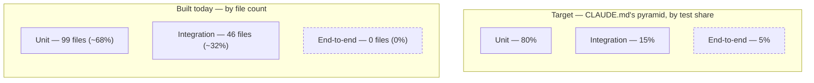

# Testing Strategy

This repository's test suite is real and runs today. 591 unit tests across 99 files live under `tests/unit/`, and 205 integration tests across 46 files live under `tests/integration/`, all passing as of this writing — `uv run pytest tests/unit -q` runs the first set in a dozen or so seconds against nothing but Python, and `uv run pytest tests/integration -q` runs the second against real infrastructure: PostgreSQL, Qdrant, Redis, and Neo4j, each spun up fresh for the run via TestContainers — a library that launches real, throwaway Docker containers around a test and tears them down when it finishes, rather than pointing tests at shared, hand-maintained infrastructure — plus, wherever a technique's correctness genuinely depends on a real forward pass rather than a mocked-out one, real small Hugging Face models such as `distilgpt2`. What follows explains why the pyramid built on top of that infrastructure is shaped the way it is for a system that mixes a stateless retrieval layer with two very different kinds of state — a GPU-resident cache and a multi-store, continuously written memory system — what each of its four tiers is actually responsible for proving here, and the concrete commands that run each of them. The reasoning below predates the code and hasn't had to change now that the code exists; if anything, what actually got built is a fairly direct confirmation of it. The one place reality and the original target genuinely diverge is the pyramid's exact proportions, addressed honestly in its own section below rather than glossed over.

## The pyramid's shape follows from what kind of thing has to be proven true

CLAUDE.md draws its test pyramid as roughly 80% unit tests, 15% integration tests, and 5% end-to-end tests, and that split isn't a convention borrowed wholesale from a generic engineering guide — it falls out of how much of this system's correctness can actually be settled by exercising logic in isolation versus how much depends on a real, stateful system behaving correctly under real conditions. CLAUDE.md's Hexagonal Architecture rule keeps the domain layer as "pure business logic, no framework dependencies" specifically so that chunking strategies, the paradigm router's classification logic, the context-budget allocator's slice math, memory-gating filters, and reranking logic can all be exercised as plain function calls against in-memory fixtures — no database, no GPU, no network call needed to know whether any of them is right. That's most of the code in a system built this way, which is exactly why unit tests are also most of the test suite: every public function or class needs a test before merge, and the majority of those functions live in a layer designed from the outset to need nothing but its own inputs to be verified.

Integration and end-to-end tests are more expensive and narrower by comparison — each one needs a real dependency running, takes longer, and proves a smaller, more specific thing — which is why the pyramid keeps them to the minority. But "expensive" isn't the same as "optional." The next two sections are about specific claims this project's own design makes that a unit test, no matter how carefully written, structurally cannot check.

## The built suite's shape, and where it honestly diverges from the target

Counted by file rather than by individual test — the more useful granularity here, since one integration-test file typically carries far fewer test functions than a unit-test file walking many branches of one pure function — the suite that exists today runs roughly 68% unit and 32% integration (99 files under `tests/unit/` against 46 under `tests/integration/`), not the 80/15/5 CLAUDE.md targets, and the end-to-end tier sits at a genuine 0%: no Playwright or Cypress configuration exists anywhere in this repository. That's not a departure from the reasoning above; it's what that reasoning produces given what's actually buildable so far. CLAUDE.md's four named end-to-end paths — a document upload landing a RAG answer, a multi-turn MAG chat, a CAG cache hit, the paradigm router choosing between them — all live at the seam between paradigms, and that seam isn't running code yet: there is no orchestration meta-layer and no frontend for a browser-driven test to exercise. The integration tier reading larger than 15% likewise isn't the domain layer coming in smaller than planned; it's that a meaningful share of what's been built so far is exactly the kind of logic the next section argues can only be verified against a real database or a real model, which by definition can't live in the unit tier.

This is a snapshot of a still-growing suite, not a ceiling. The end-to-end tier's 0% specifically tracks the absence of an orchestration layer and a frontend — both of which CLAUDE.md describes as work this repository is committed to building toward, not work that's been abandoned — and closes once there's an actual seam between paradigms for a browser to click through.

## Integration tests exist because MAG's and CAG's core promises are exactly what a mock can't verify

CLAUDE.md's non-negotiable testing rule is blunt about this: integration tests use "real DB, real Qdrant, real Redis (TestContainers)," not mocked stand-ins, and its testing-strategy section names three concrete things this project intends to prove against those real dependencies — a RAG pipeline run against sample documents, a CAG prefix-cache hit checked against a real vLLM instance, and "MAG memory lifecycle (write → consolidate → retrieve)." That last one is the clearest case for why mocking would defeat the point. CLAUDE.md's own paradigm table describes MAG's mutability in two words — "Continuous writes" — and its whole reason for existing is that state persists and evolves across a session instead of being reconstructed from scratch each turn. Its memory model is explicitly split by CQRS — Command Query Responsibility Segregation, the pattern of giving the code path that changes data and the code path that reads it separate models instead of one shared one — into a write path optimized for frequent, asynchronous persistence and a read path optimized for multi-strategy retrieval ("Separate read and write models for MAG memory operations," in CLAUDE.md's own words). ADR-0004, which records the reasoning behind that split, is direct about what it costs: keeping the two sides consistent — its own example is "ensuring a newly consolidated semantic fact is visible to the next multi-strategy read" — "requires deliberate synchronization rather than falling out automatically from a shared model" (`docs/decisions/adr/0004-hexagonal-cqrs-for-mag.md`). A mocked write path can be hand-coded to return whatever a test expects; it cannot tell you whether a fact written through the command side is the fact the query side actually reads back, whether the Celery-driven consolidation job that is supposed to turn a batch of raw episodes into a durable semantic fact actually ran and left something a later read can find, or whether the synchronization ADR-0004 flags as non-automatic actually held in this instance. Proving any of that needs a real database a write can land in and a real read run against it afterward, which is what TestContainers gives an integration test and a mock, by construction, cannot.

CAG's case is different in shape but the same in kind. CLAUDE.md's Latency-Adaptive Fallback Cascade treats a CAG cache hit as trustworthy enough to "return immediately," with neither MAG nor RAG consulted afterward to double-check it — they only run at all on a CAG miss. That design only holds up if a CAG cache hit is actually correct, and correctness here is a caching problem, not a business-logic one: does the KV cache invalidate properly when the underlying prefix changes, does eviction under memory pressure drop the wrong tokens, does a request that should miss the cache get served a stale hit instead. "Cache invalidation when prefix changes" is named as a real, open challenge for prefix caching in this project's own source material on the technique (`docs/inputs/concepts/advanced_cag_concepts.md`), and none of those failure modes exist inside a mock — a stubbed cache client told to return "hit" will return "hit" regardless of whether vLLM's actual PagedAttention block manager and eviction policy would have produced one. That's why this project's testing strategy calls specifically for testing CAG prefix caching against vLLM itself rather than a stand-in: the fallback cascade's first tier is only as trustworthy as the real caching behavior underneath it, and only a real serving engine can demonstrate that behavior. RAG's integration test earns the same real-Qdrant requirement for a related reason: hybrid search's vector-plus-BM25 ranking is the thing under test, and a mock that returns arbitrary results can't demonstrate that an actual HNSW index and rank-fusion step order documents the way this project's retrieval design assumes they will.

That argument now has direct, on-point evidence inside the suite itself, beyond CAG's and RAG's own tests: `test_rls_tenant_isolation.py`, `test_mag_rls_tenant_isolation.py`, and `test_rag_rls_tenant_isolation.py` exist specifically to prove tenant isolation holds against a real, row-level-security-enabled Postgres instance, rather than trusting that a mocked repository would refuse to leak another tenant's rows the same way a real RLS policy does. Row-level security for tenant isolation is one of the twenty controls CLAUDE.md's Security is a checklist, not a vibe rule names outright, and it fails for exactly the same structural reason MAG's write-then-read cycle does: the guarantee lives in the database engine's own policy enforcement, not in application code a test double could stand in for, so only a real database with the policy actually attached can show it holding.

## Unit tests are where most of the system's actual logic gets checked, cheaply

Concretely, a unit test here means exercising one function or class in the domain layer in isolation — a chunking strategy given a fixed document, the paradigm router given a classified query, the context-budget allocator given a token count, a memory-gating filter given a token budget and a list of candidate facts — with every external dependency (the database, the LLM, the vector store) mocked out. Coverage is meant to sit at 80% or higher of lines, matching the same figure the pyramid itself uses to describe this tier's share of the suite. Nothing about this tier needs a running database, a GPU, or a network call, which is what makes it viable to run constantly during day-to-day development rather than saved for occasional, deliberate runs against live infrastructure.

## End-to-end tests watch the paradigms hand off to each other, which no smaller tier can see

CLAUDE.md restricts end-to-end coverage to "critical paths only" and names four of them: a document upload followed by a RAG-answered question, a multi-turn chat where MAG carries context across turns, a repeated query against static documents landing a CAG cache hit for an instant response, and the paradigm router sending different query types down the right path. What all four have in common is that they only exist at the seam between paradigms. A unit test can prove the router's classification function returns the right label for a given input, and an integration test can prove MAG's write-then-read cycle works against a real database, but neither one runs an actual request through the orchestration meta-layer CLAUDE.md describes as the thing deciding "which paradigm handles which piece of knowledge at which moment" — with a real browser and a real backend on both ends. That's also why this tier stays the smallest slice of the pyramid: it's the most expensive kind of test to write and run, so it's reserved for the handful of paths where the interaction between paradigms, not the logic inside any single one, is what's actually being verified.

The closest thing to an end-to-end check that exists today is `tests/integration/test_docker_compose_smoke.py`, which its own docstring calls a "manual end-to-end smoke test for the real Docker Compose stack" — it drives the actual register → login → refresh → logout auth flow over real HTTP against a running `docker compose` stack, not against TestContainers or an in-process app instance. That makes it closer in spirit to this tier than anything else in the suite, but it's still a pytest script talking to HTTP endpoints rather than a browser-driven test, and CI doesn't run it: the file keeps its `test_` prefix so it's discoverable inside `tests/integration/`, but deliberately defines no `test_*` function, so `pytest tests/` walks past it silently and it has to be run directly instead. It's a real, disclosed placeholder for this tier — evidence the pattern is understood and partly rehearsed — not a substitute for the browser-driven suite CLAUDE.md actually describes, and that's worth naming plainly rather than leaving implicit in the file-count numbers above: no Playwright or Cypress setup exists anywhere in this repository, so this tier is a real 0% today, not a smaller-than-intended-but-present slice.

## Performance tests check the latency budgets the architecture assumes, not just general speed

Everything above is about whether the system produces the right answer; performance testing is about whether it produces that answer inside the time budget the rest of the architecture is designed around, which is why CLAUDE.md keeps it as its own category rather than folding it into the pyramid's proportions. CLAUDE.md's performance-testing section names time-to-first-token, throughput, and P95/P99 latency as the metrics, `scripts/benchmark.py` as the intended dedicated entry point, and k6 or Locust for load testing — and its stated targets line up directly with the timeouts the Latency-Adaptive Fallback Cascade already assumes are achievable: a CAG cache hit under 10ms matches the cascade's own 10ms budget for checking the cache, and MAG retrieval under 50ms matches the cascade's 50ms budget for checking memory. RAG's target of under 300ms sits comfortably inside the cascade's far more generous 2-second RAG timeout. `scripts/benchmark.py` still doesn't exist — confirmed by a direct search of the repository — so that dedicated entry point and the k6/Locust load-test commands remain design intent rather than something to run today.

Real, disclosed-methodology latency measurement already happens inside `tests/integration/`, without waiting on that still-unbuilt path. `test_working_memory_latency.py` is a live comparison aimed at exactly the latency claim CLAUDE.md's paradigm table makes for MAG ("1–10ms", against Redis + PostgreSQL + Neo4j): whether reading a session's recent turns from Redis, the fast working-memory tier, is meaningfully faster than reading the same logical rows from Postgres, the durable store. It runs against real TestContainers Postgres and Redis, confirms Postgres is genuinely using its index via `EXPLAIN` rather than assuming it, and times a p50 over 50 reads after a warmup. `docs/architecture/MAG.md`'s own Memory Hierarchy section already documents this test's result plainly rather than the architecture's original prediction: an earlier version of the benchmark reported Redis 1.39x faster, then retracted that claim once an `ANALYZE` call meant to keep Postgres's query planner correctly informed was found to be silently no-op-ing through an under-privileged connection. Once fixed, four corrected runs against 12,000 episodic-memory rows spread across 400 sessions showed Postgres at or slightly *faster* than Redis, with p50 ratios between 0.94x and 0.98x, both paths comfortably sub-millisecond. That's a narrow, disclosed result at one tested scale, not a general finding that Redis never helps the working-memory tier — the underlying reasoning (a Redis key's cost doesn't grow with how many other sessions exist in the system, where a B-tree lookup's cost has some dependence, however sub-linear, on total table size) is still sound in principle, and MAG.md is explicit that whether the gap becomes measurable at a larger table, under concurrent load, or over a real network rather than loopback remains untested rather than confirmed either way. It's included here specifically because CLAUDE.md's own rule is to disclose what a live measurement actually shows rather than what the architecture predicted, and this is that rule holding in practice, not just in principle.

CAG has its own real measurement, of a different kind. `evaluation/reports/cag-speculative-decoding.md` reports forward-pass reduction and candidate-acceptance rate for all three of CAG.md's named speculative-decoding variants, measured against a real `distilgpt2` model rather than a mock: Prompt Lookup Decoding at 3.00x fewer forward passes with 81.8% of proposed candidates accepted, landing at the high end of CAG.md's stated 2–3x typical range; Medusa at 2.00x with 25.0% acceptance, matching exactly what the report's own disclosed simplification — untrained, warm-started prediction heads — predicts mechanistically; and Lookahead Decoding at 1.09x with 12.5% acceptance, an honest result below CAG.md's stated range, reported as measured rather than adjusted to look better. None of this substitutes for the TTFT/throughput/P95 load-testing `scripts/benchmark.py` is still meant to eventually provide against a real serving stack under concurrent load — these are narrower, single-technique, CPU-only measurements — but they're real, disclosed numbers in a category this document previously described as having none.

## Commands

These commands run today, against the real suite described above. Where a tier doesn't yet have a documented command of its own, that's stated plainly below rather than invented.

| Tier | Command | Notes |
|---|---|---|
| Unit | `pytest tests/unit/ --cov=src --cov-report=term-missing` | CLAUDE.md's literal invocation for this tier; runs today (591 tests, 99 files) and the coverage flags produce a real per-file report against the ≥80% target |
| Unit (day-to-day) | `uv run pytest tests/unit -q` | The quieter form used for a fast, no-infrastructure check; needs nothing but Python, no Docker or GPU |
| Integration | `uv run pytest tests/integration -q` | Runs today (205 tests, 46 files) against real PostgreSQL, Qdrant, Redis, and Neo4j provisioned through TestContainers — Docker has to be running first |
| Whole suite | `uv run pytest tests/ --cov=src` | The general entry point listed among CLAUDE.md's Quick Commands; runs every tier under `tests/` in one pass |
| End-to-end | Not yet specified | Playwright or Cypress is the named framework; no setup and no invocation command exist yet — see the honest 0% noted above |
| Performance | `scripts/benchmark.py` | Still doesn't exist; the exact CLI invocation and the k6/Locust load-test commands remain unspecified. Real, narrower latency and forward-pass measurements already exist inside `tests/integration/` and `evaluation/reports/`, described above |
